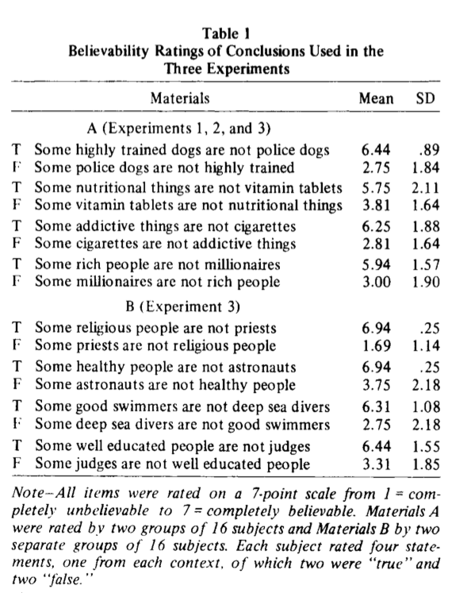

## Why do we learn statistics?

---

Why, why, why???

---

#### valid argument — believable conclusion

 
No cigarettes are inexpensive  
Some addictive things are inexpensive  
Therefore, some addictive things are not cigarettes  

---

#### valid argument — less believable conclusion

 
No addictive things are inexpensive  
Some cigarettes are inexpensive  
Therefore, some cigarettes are not addictive  

---

#### invalid argument — believable conclusion

 
No addictive things are inexpensive  
Some cigarettes are inexpensive  
Therefore, some addictive things are not cigarettes  

---

#### invalid argument — less believable conclusion

 
No cigarettes are inexpensive  
Some addictive things are inexpensive  
Therefore, some cigarettes are not addictive  

---

#### When intuitions clash with logic

|                     | conclusion feels true | conclusion feels false |
|---------------------|-----------------------|------------------------|
| argument is valid   | 92% say "valid"       | 46% say "valid"        |
| argument is invalid | 92% say "valid"       | 8% say "valid"         |

Evans et al (1983)

---

#### How we do know what "feels true"?

Evans et al (1983)

---

---
## References

Evans, J. S. B., Barston, J. L., & Pollard, P. (1983). On the conflict between logic and belief in syllogistic reasoning. _Memory & cognition_, _11_(3), 295-306.