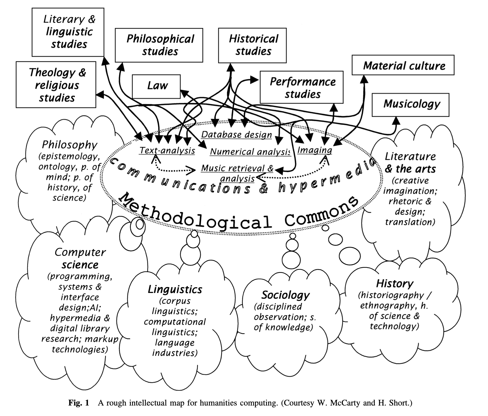

---
slideNumber: true
---

## Experimental Psycholinguistics

Teacher: Ethan Weed

Instructor: Niels Aalund Krogsgaard

TEST!!!

---

## Today

1. Course goals
2. Course structure
3. Exam
4. Introductions

---

## Humanities Computing

---

> computing belongs within the humanities because it accords  with their central project: to help scholars ask better questions.

---
## Concordance of the Bible

The first concordance, completed in 1230, is said to have been written by 500 Dominican munks.

---

---
## Here is a list

1. thing
2. another thing
3. a third thing

---

## Thanks!

