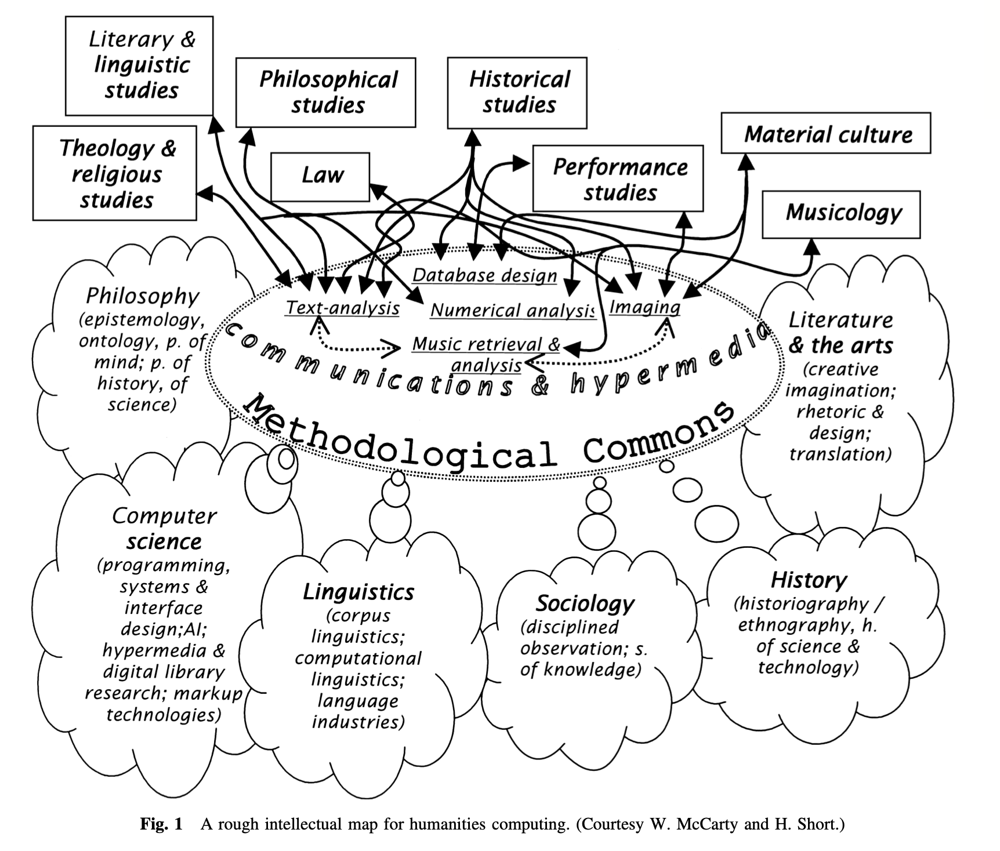
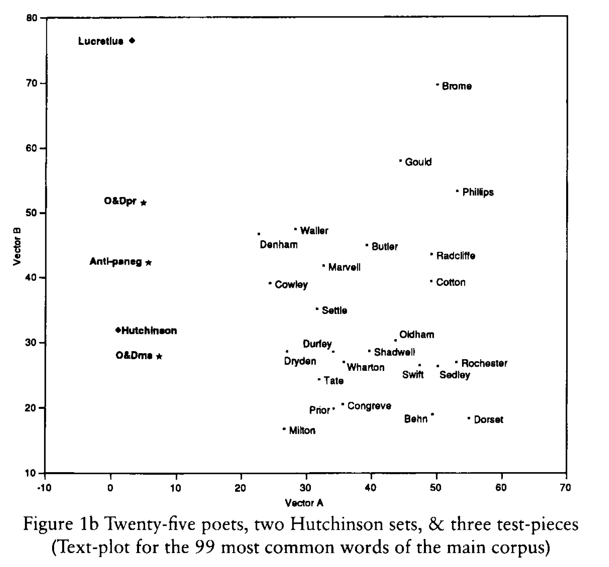

 

## Experimental Psycholinguistics

<style>
.container{
  display: flex;
}
.col {
  flex: 1;
}
</style>


Teacher: Ethan Weed

Instructor: Niels Aalund Krogsgaard


---

## Today

1. Course goals
2. Course structure
3. Exam
4. Introductions
5. Why so much computer stuff?

---

### Testing, testing, 1, 2, 3


::: {.container}
:::: {.col}

::::
:::: {.col}
- Observation 1: Hearing a backwards count interfered with my ability to count forwards.
::::
:::

---

### Testing, testing, 1, 2, 3


::: {.container}
:::: {.col}

::::
:::: {.col}
- Observation 2: Hearing other language does not interfere with my ability to count forwards.
::::
:::

---

### Testing, testing, 1, 2, 3

- What could explain this phemonenon?
- What hypothesis/hypotheses does your explanation generate?
- How could you test your hypothesis/hypotheses?


---


#### Course goals 1

We will investigate the cognitive systems involved in...

---


::: incremental

- working memory
- the categorization of meaning
- accessing our lexical representations
- understanding language in context

:::


---

#### Course goals 2

Learn to: 

---

::: incremental

- translate theories to research hypotheses
- translate research hypotheses to statistical hypotheses
- interpret statistical results in relation to theories

:::


---


---

#### Course goals 3

Taken together, the overall goal of the course is for you to learn to...

---

1. Understand the relationship between theoretical concepts and data

---

2. Operationalize theoretical concepts experimentally through measurable indices

---

3. Analyze and interpret findings in a critical way

---

4. Communicate experimental findings in a clear way to both expert and lay audiences

---

### Course structure

- Lectures
- Labs
- Instructor Sessions

---

## Introductions

---

#### Exam

Pass/fail portfolio

1. Three lab reports, completed throughout  the semester, using the [lab report template](https://github.com/ethanweed/ExPsyLing/raw/master/2021/Resources/Experimental%20Report%20Template.doc)
2. Proof of completion of online GDPR course in either <a href="https://brightspace.au.dk/d2l/le/discovery/view/course/27011" target="_blank">Danish</a> or <a href="https://brightspace.au.dk/d2l/le/discovery/view/course/30198" target="_blank">English</a>
3. Design Your Own Experiment: Introduction and Methods sections for a proposed experiment on a topic of your choice

---

#### Why so much computer stuff?


---


#### Humanities Computing





---

> "computing belongs within the humanities because it accords  with their central project: to help scholars ask better questions."

\- McCarty(2003)

---

#### Concordance of the Bible


"commonplace physical devices for manipulating knowledge" \-McCarty(2003)

---

#### Concordance of the Bible

The first concordance of the Latin Bible was completed in 1230, and is said to have been written by 500 Dominican munks.

---

The first concordance of the Hebrew Bible was written by a single person, Rabbi Mordecai Nathan, and was completed in 1448 after 10 years of work.

---

It took me 10 minutes to find every occurrence of "this world" in the King James bible:

```
bigrams = []
for i, val in enumerate(text2):
    if val == "world":
        if text2[i-1] == "this":
            bigrams.append(str(' '.join(text2[i-5:i+5])))
```

---

Here are they are:

```
['for the children of this world are in their generation',
 'them, the children of this world marry, and are given',
 'hateth his life in this world shall keep it unto',
 'shall the prince of this world be cast out. ',
 'should depart out of this world unto the father, having',
 'for the prince of this world cometh, and hath nothing',
 'because the prince of this world is judged.  16:12',
 'of the princes of this world knew: for had they',
 'for the wisdom of this world is foolishness with god.',
 'for the fashion of this world passeth away.  7:32',
 'whom the god of this world hath blinded the minds',
 'chosen the poor of this world rich in faith, and',
 'saying, the kingdoms of this world are become the kingdoms']
 ```

---

#### Interesting comparisons

```
['for the children of this world are in their generation',
 'them, the children of this world marry, and are given',
 'hateth his life in this world shall keep it unto',
 'shall the prince of this world be cast out. ',
 'should depart out of this world unto the father, having',
 'for the prince of this world cometh, and hath nothing',
 'because the prince of this world is judged.  16:12',
 'of the princes of this world knew: for had they',
 'for the wisdom of this world is foolishness with god.',
 'for the fashion of this world passeth away.  7:32',
 'whom the god of this world hath blinded the minds',
 'chosen the poor of this world rich in faith, and',
 'saying, the kingdoms of this world are become the kingdoms']
 ```


---

#### Algorithmic thinking: find musical phrases


---

#### Algorithmic thinking leads to [ontological](https://en.wikipedia.org/wiki/Ontology) thinking

>"the interest lies in the questions raised by such algorithmic thinking, especially by the inevitable mismatch between any algorithm and data of the sort normal to the humanities. This mismatch forces ontological questions that lead back to one or more fundamental problems in the discipline of origin and may at the same time illuminate basic methodological issues relevant beyond it."

---

#### Metalinguistic thinking: tagging utterances with XML

html:
```
I study at <a href="https://www.au.dk">Aarhus Universitet</a>.

```

xml (source: http://www.talkbank.org)
```
  <u who="MOT" uID="u25">
    <w>what</w>
    <w>are</w>
    <w>these</w>
    <t type="q"></t>

    <a type="coding">$LAN:E $ADD:CHI</a>
  </u>

```

---


#### Metalinguistic thinking leads to clear thinking

>"deep encoding is very laborious, and it is precisely the kind of task in which the full range of scholarly abilities are required. It thus demonstrates that encoding can itself be a form of rather than preparation for scholarship. This new form is shaped by the two imperatives of computational tractability, namely **total explicitness** and **absolute consistency.**"

---

#### Representational thinking: visualizing authorial voice




---

#### Representational thinking leads to new insights

>"... arranging, formatting, or otherwise transforming the appearance of data \[leading to] what Arnheim has called 'visual thinking'"

---


#### References


<font size="1"> 

Burrows, J., & Craig, H. (2001). Lucy Hutchinson and the authorship of two seventeenth-century poems: a computational approach. _The Seventeenth Century_, _16_(2), 259-282.

Cambouropoulos, E., Crawford, T., & Iliopoulos, C. S. (2001). Pattern processing in melodic sequences: Challenges, caveats and prospects. _Computers and the Humanities_, _35_(1), 9-21.

McCarty, W. (2003). Humanities computing. _Encyclopedia of library and information science_, _2_, 1224.

Paradis, J., Nicoladis, E., & Genesee, F. (2000) Early emergence of structural constraints on code-mixing: Evidence from French-English bilingual children. Bilingualism: Language and Cognition, 3: 245-261.

</font>
	

