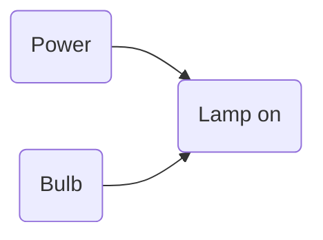
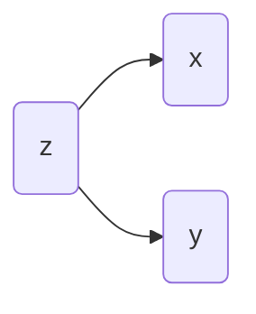
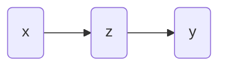
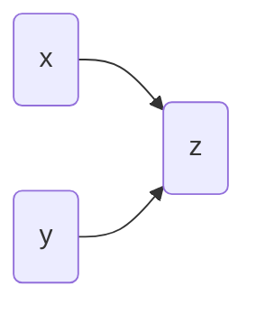
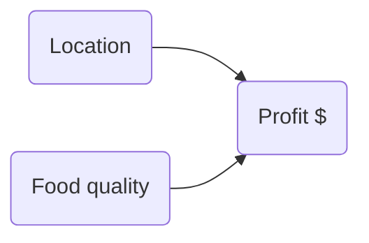

https://www.youtube.com/watch?v=KNPYUVmY3NM

Ptolomeic model predicts the regression of Mars very accurately, but is completely wrong.

Knowing a cause means being able to predict the consequences of an intervention. What happens if I do _this_?

Non-causal statistics

Adversarial image research neural networks

AIC would happily chose Ptolomey's model of the solar system

DAG's make no statements about _how_ a variable influences an outcome

Reserachers with lots of domain knowledge can make very complicated DAGs

McElreath (1:10) in https://www.youtube.com/watch?v=KNPYUVmY3NM:
"Hang on! Which part of this do we care about?"

"Obviously the whole world is one causal system, but you don't have to analyze it at once!"

Fork:

Pipe:

Collider:

The fork and the pipe **look the same** in the data alone. We need _other_ scientific knowledge to distinguish them.

Collider example: Restaurants

A restaurant in a good location does not need to have good food to survive.
A restaurant in a bad location needs something else (e.g. good food) to survive.
The only restaurants that survive have at least one of these.
In the restaurants that survive, there tends to be a negative correlation between how good the location is, and how good the food is.
Selection bias.

