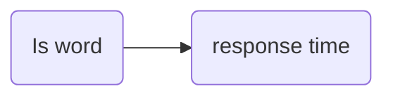
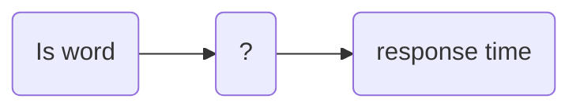
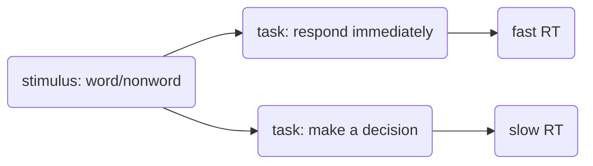

Do word vs. pseudoword lexical access task (decoding)

RT to words
RT to non-words

Obviously, the mere fact of the stimulus being a word or not does not cause the response time. It is mediated by some sort of cognitive structure.

If the task is just to press a button in response to any stimulus, then we would expect that responses should be slower when no decision is required than when we need to decide on a word vs. a non-word.

This leads us to [[Experiment 1 models]]

