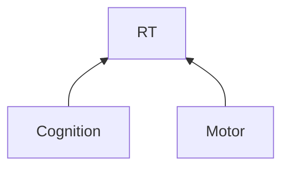
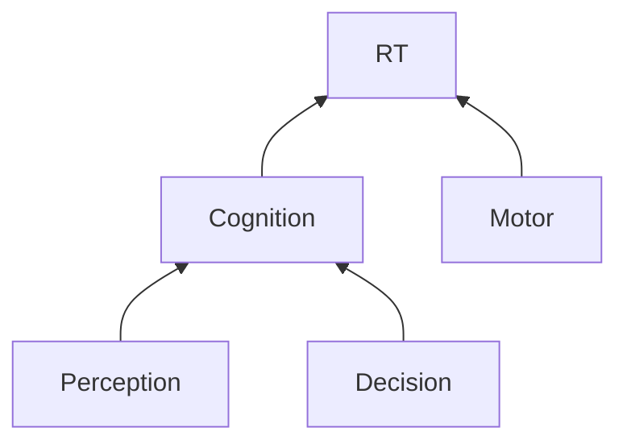
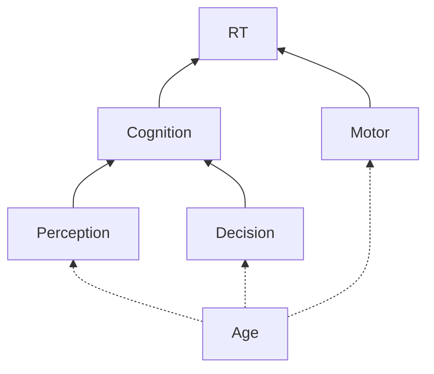
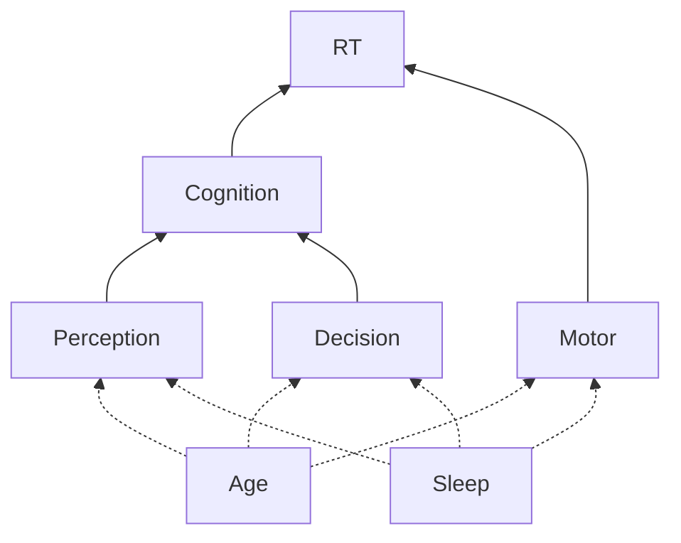
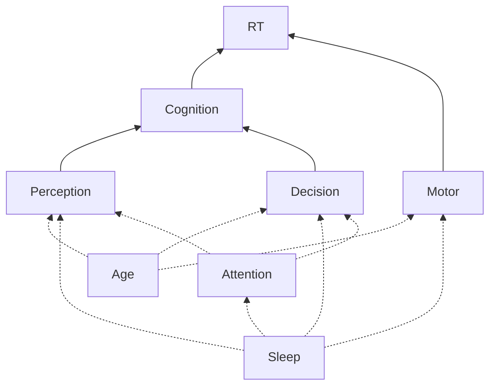
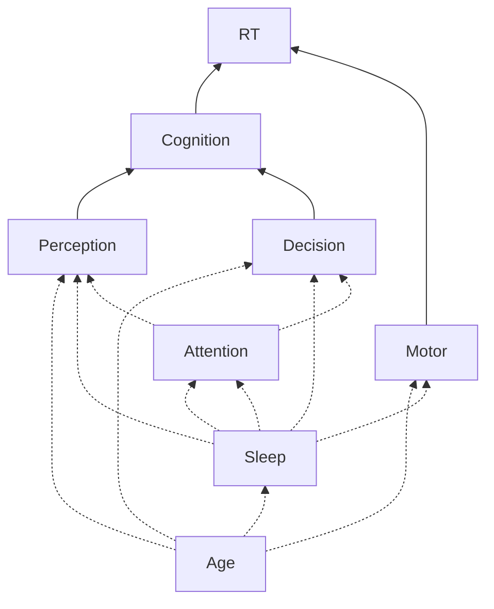
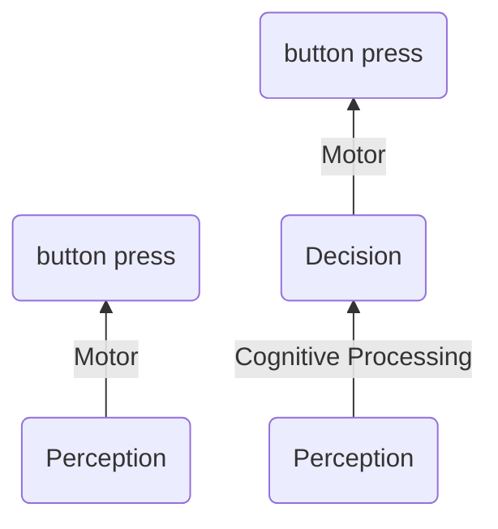
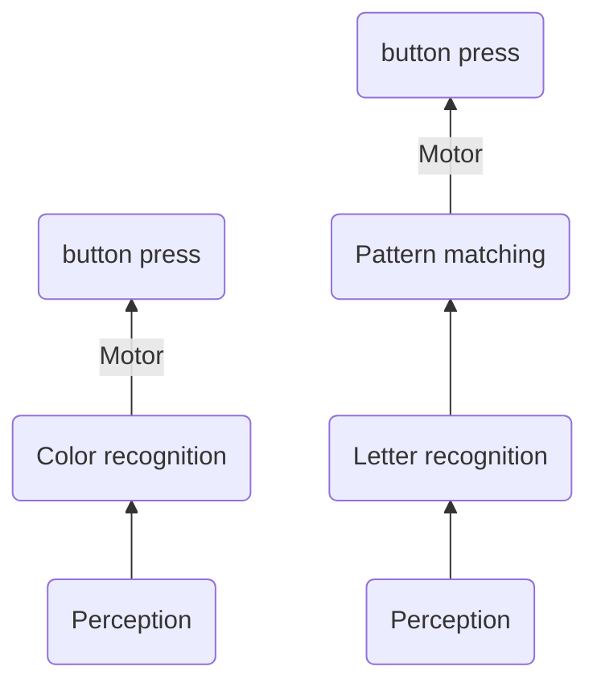

[[Planning]]

## Deconstructing response time

What are some of the many factors that affect response time? That is, what are we _actually_ measuring, when we measure response time?

## Model 1

## Model 2

## Model 3

## Model 4

## Model 5

## Model 6

---

## Experiment 1a: Hypotheses

### Cognitive model
Making a decision in response to a cue requires more cognitive effort than simply responding immediately to the cue, therefore we expect that on average, RT will be slower when a decision is required.

### Statistical model(s)

## $RT_{Perception} < RT_{Perception + Decision}$
(One-tailed)

## $RT_{Perception} ≠ RT_{Perception + Decision}$
(Two-tailed)

---

## Experiment 1b: Hypotheses

### Cognitive model
Deciding whether a string of letters is a word or not is more cogntively demanding than recognizing a color. Therefore, we expect RT to slower in a lexical decision task than in a color recognition task.

### Statistical model(s)

## $RT_{ColorCategorization} < RT_{LexicalDecision}$
(One-tailed)

## $RT_{ColorCategorization} ≠ RT_{LexicalDecision}$
(Two-tailed)

