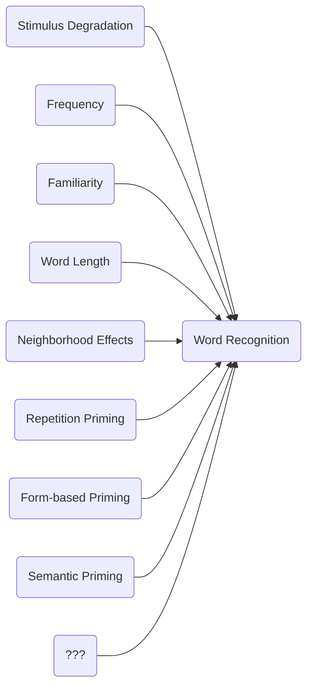
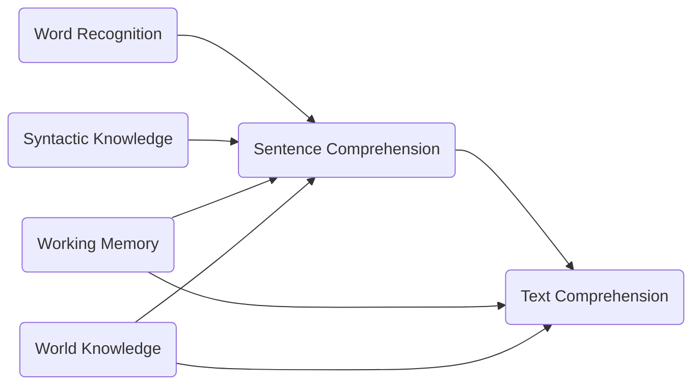

```mermaid
graph LR
boxb(Stimulus Degradation)-->boxa(Word Recognition)
boxc(Frequency)-->boxa(Word Recognition)
boxd(Familiarity)-->boxa(Word Recognition)
boxe(Word Length)-->boxa(Word Recognition)
boxf(Neighborhood Effects)-->boxa(Word Recognition)
boxg(Repetition Priming)-->boxa(Word Recognition)
boxh(Form-based Priming)-->boxa(Word Recognition)
boxi(Semantic Priming)-->boxa(Word Recognition)
boxj(???)-->boxa(Word Recognition)
```

```mermaid
graph LR
boxa(Word Recognition)-->boxk(Sentence Comprehension)
boxk(Sentence Comprehension)-->boxl(Text Comprehension)
boxm(Syntactic Knowledge)-->boxk(Sentence Comprehension)
boxn(Working Memory)-->boxk(Sentence Comprehension)
boxn(Working Memory)-->boxl(Text Comprehension)
boxo(World Knowledge)-->boxk(Sentence Comprehension)
boxo(World Knowledge)-->boxl(Text Comprehension)
```
