# Two current frameworks

:::::: {.two-col}

::: {}
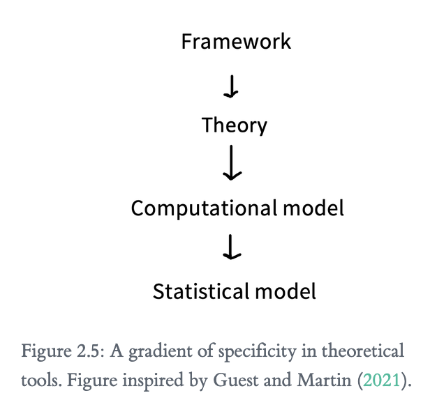
_A gradient of specificity in theoretical tools, [@petrovicsExperimentologyOpenScience2025]_
:::

::: {}

- Embodiment (embodied / grounded cognition)
- Predictive coding

:::

::::::

---

# Framework 1: Language & Embodiment (Clark)

Notes from [@clarkLanguageEmbodimentCognitive2006]

---

## Thought & Language

:::::: {.two-col}

::: {}

_Wilhelm von Humboldt, by Thomas Lawrence_
:::

::: {}

- What is the relationship between thought and language?
- Humboldt (early 19th c.)
- Sapir & Whorf (linguistic relativity)

:::

::::::

---

## Fodor's Language of Thought

:::::: {.two-col}

::: {}
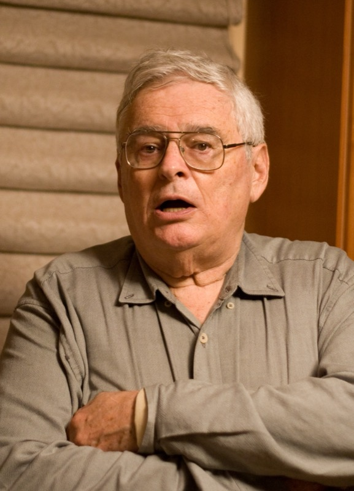
_Jerry Fodor_
:::

::: {}

- "Mentalese": cognition = symbol manipulation
- Mind combines mental symbols by rule, like language combines morphemes by syntax
- Natural languages (English, Danish...) map onto Mentalese
- Understanding speech = translation into Mentalese

:::

::::::

---

## LoT, Chomsky, and Information Theory

:::::: {.two-col}

::: {}

_Noam Chomsky_
:::

::: {}

- Fits with Chomsky's Universal Grammar
    - Language = "I-language"
    - Natural languages = "E-language"
- Reminiscent of Shannon & Weaver's Information Theory

:::

::::::

---

## Embodied Language

:::::: {.two-col}

::: {}
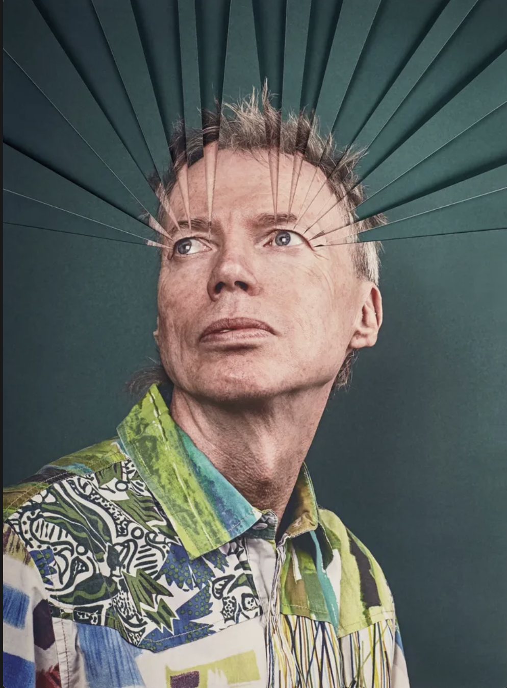
_Andy Clark_
:::

::: {}

- Language is a cognitive **tool**, not a translation layer
- Not just external expression of Mentalese
- Language plays an active role in the thinking process itself

:::

::::::

---

## Language allows abstraction

:::::: {.two-col}

::: {}
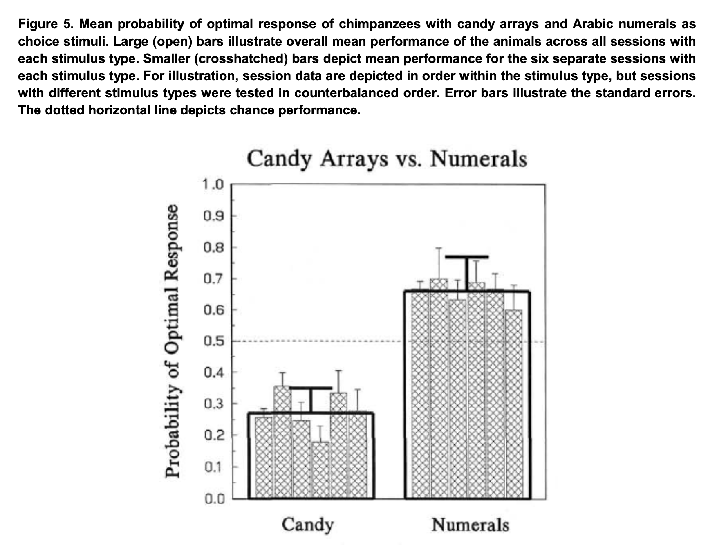
_Fig. 5, [@boysenQuantityBasedInterferenceSymbolic]_
:::

::: {}

- Boysen et al. [@boysenQuantityBasedInterferenceSymbolic]
- Symbols let chimps abstract away from actual treats
- Enables more advantageous choices
- External symbols as stepping stones to more advanced thinking

:::

::::::

---

## Inner Speech

:::::: {.two-col}

::: {}
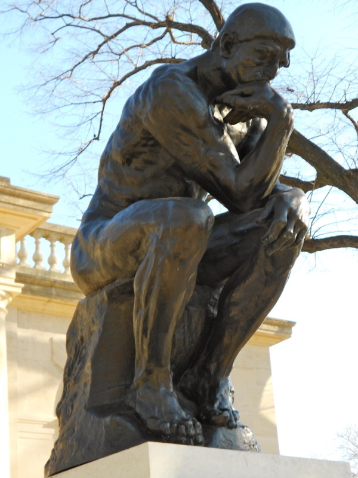
_The Thinker, Philadelphia_
:::

::: {}

- Mental rehearsal of things we need to remember
- Inner speech as a tool to:
    - focus attention
    - prevent forgetting
    - hold information in working memory

:::

::::::

---

## Gesture and Collaboration

:::::: {.two-col}

::: {}

_My Neighbor Totoro [@miyazakiMyNeighborTotoro1988]_
:::

::: {}

- Gesture / drawing: placing an idea "in space" to refer back to it later
- Creative problem-solving using externalised symbols
- Interactive tasks: participants develop local shared vocabulary [@fusaroliComingTermsQuantifying2012]
- Language as external tool for collaborative thinking

:::

::::::

---

## Writing as thinking

:::::: {.two-col}

::: {}

_Journaling_
:::

::: {}

- Act of writing clarifies thought
- The writing *is* part of the thinking, not just its output

:::

::::::

---

## The Central Executive

:::::: {.two-col}

::: {}
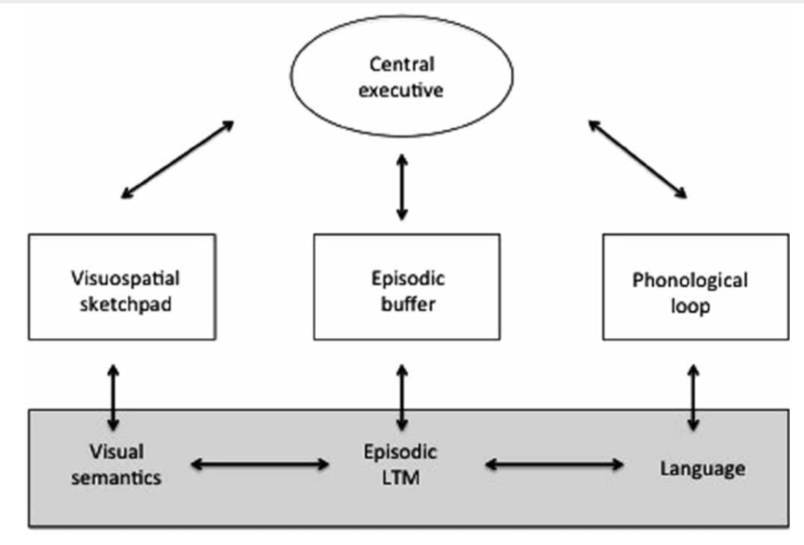
_Baddeley & Hitch's working memory model (with episodic buffer)_
:::

::: {}

- Baddeley & Hitch model of working memory
- More complex than Sperling's model (previous class)
- Components: visual, phonological, (later) episodic
- "Central Executive" hovers over all: decides what to pay attention to

:::

::::::

---

## Do we need the Central Executive?

:::::: {.two-col}

::: {}
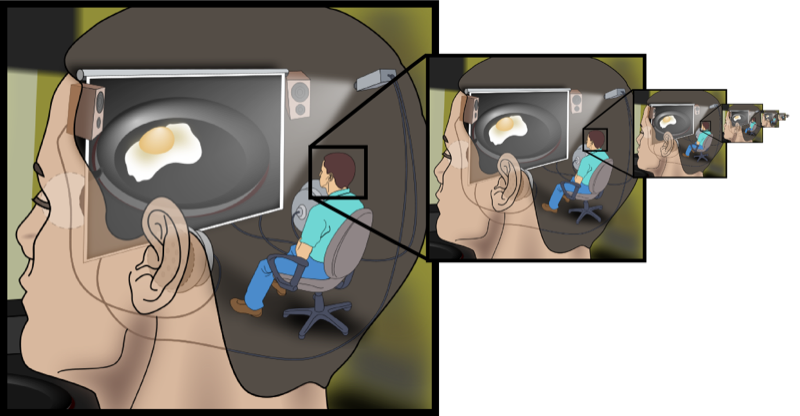
_The homunculus argument: infinite regress of a "little man" managing the mind_
:::

::: {}

- No LoT doing the "real" thinking
- No Central Executive managing everything
- Mind
	- dynamic system 
	- many processes simultaneously active and interacting

:::

::::::

---

## Embodied Cognition

:::::: {.two-col}

::: {}
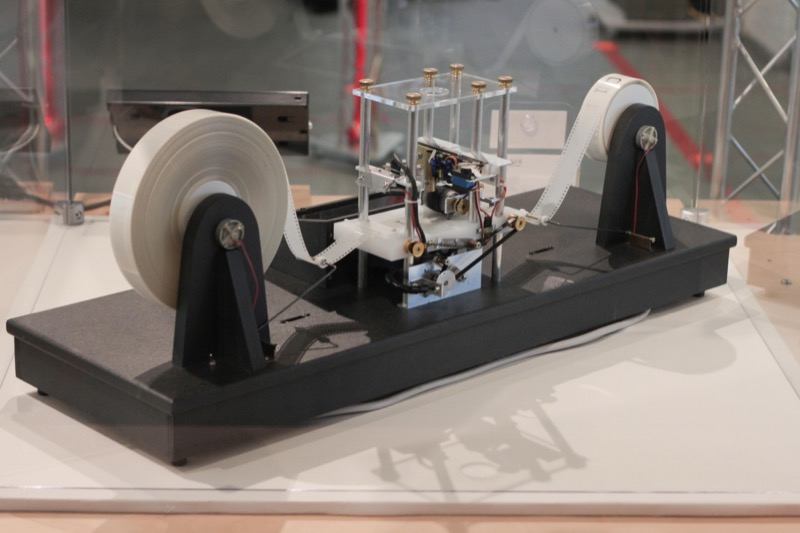
_A physical Turing machine model_
:::

::: {}

- Processes interact internally (in the mind) **and** externally (via speech, writing)
- We place thoughts in the world with language, then use language to develop them
- This paper is one expression of a broader embodied cognition framework
- Common thread: move beyond mind as "disembodied calculator"

:::

::::::

---

# Framework 2: Predictive Coding (Lupyan & Clark)

Notes from [@lupyanWordsWorldPredictive2015]

---

## Framework basics

:::::: {.two-col}

::: {}

_A black swan_
:::

::: {}

- Cognition as ongoing prediction about the external world
- "Inferential thinking"
- We constantly assume what's likely to happen next, based on prior experience
- Confirmed predictions → stronger prior beliefs

:::

::::::

---

## Embodiment meets prediction

:::::: {.two-col}

::: {}

_Multistability: the same input, seen two ways_
:::

::: {}

- Embodied framework: individuals in relationship to their environment
- Internal representations (including linguistic ones) shape
    - perception of the world
    - action on and in the world

:::

::::::

---

## Weighting priors vs. sensory input

:::::: {.two-col}

::: {}

_Trail Ridge Road, Rocky Mountain National Park_
:::

::: {}

- Navigating home in the dark: weight prior knowledge heavily (little sensory info)
- Driving an unfamiliar road: weight sensory input heavily (can't predict what's around the bend)

:::

::::::

---

## Prediction error

:::::: {.two-col}

::: {}

_Change blindness demo_
:::

::: {}

- Prediction is usually unconscious until violated
- We often become aware of a prediction only through the prediction errors

:::

::::::

---

## Top-down vs. bottom-up: Fig. 3

:::::: {.two-col}

::: {}
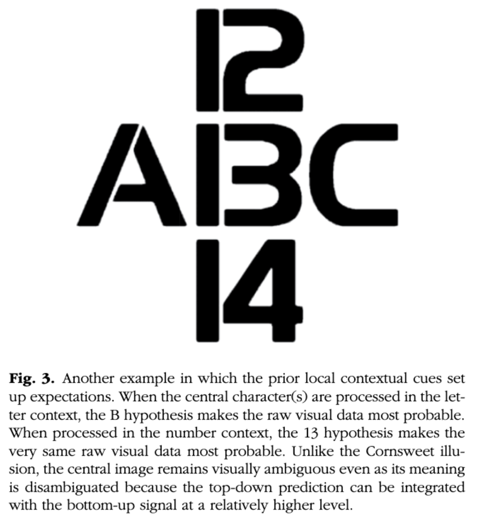
_Fig. 3, [@lupyanWordsWorldPredictive2015]_
:::

::: {}

- Identical sensory input (the central character)
- Perceived differently depending on prediction frame: numerical vs. alphabetical context
- Prediction shapes perception, not just interpretation after the fact

:::

::::::

---

## Phonemic Restoration

:::::: {.two-col}

::: {}
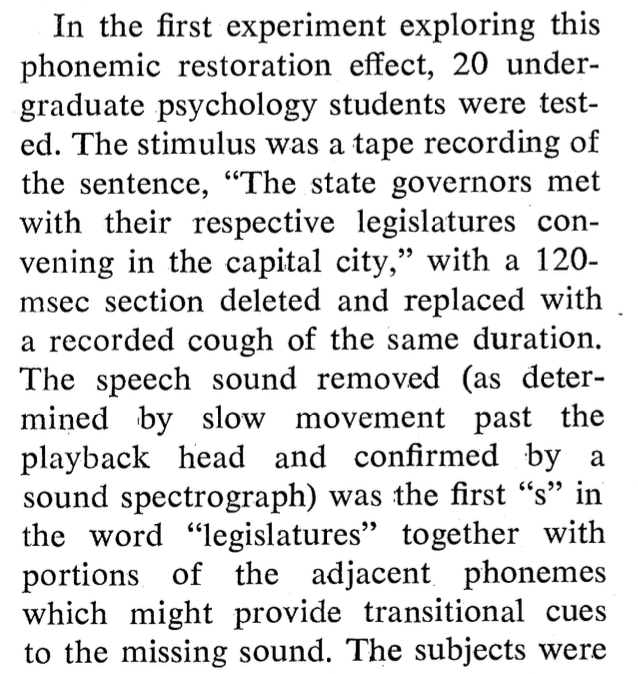
_Phonemic restoration, [@PerceptualRestorationofMissingSpeechSounds]_
:::

::: {}

- Warren (1970): removed or replaced phonemes with noise
- Listeners didn't notice — heard the expected phoneme anyway
- Top-down prediction overriding bottom-up sensation

:::

::::::

---

## More evidence: jumbled letters

:::::: {.two-col}

::: {}
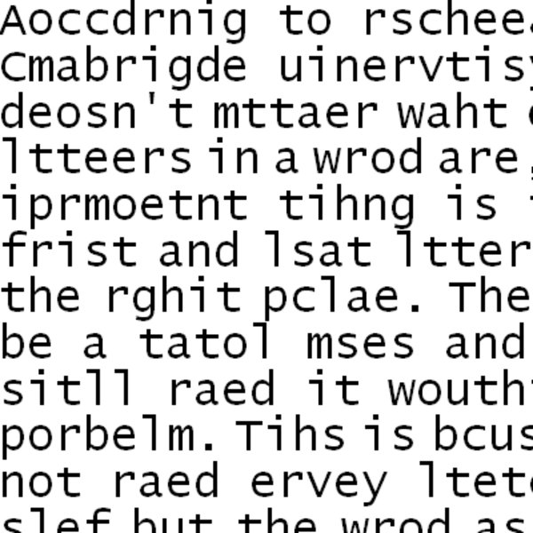
_"Aoccdrnig to a rscheearch..."_
:::

::: {}

- The internet "jumbled letters" phenomenon: readable despite scrambled order
- Difference from phoneme restoration: here we're usually *aware* letters are mixed up
- But we can still read it anyway — prediction fills the gap

:::

::::::

---

## Rethinking attention

:::::: {.two-col}

::: {}
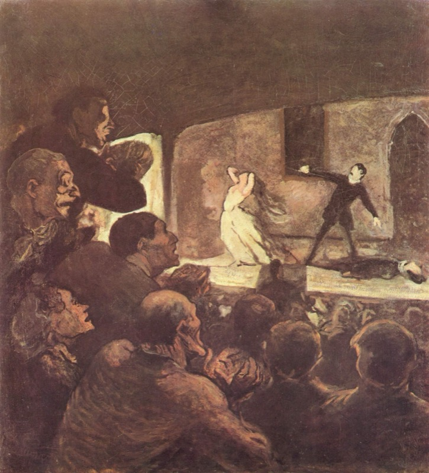
_The Melodrama, Honoré Daumier_
:::

::: {}

- Classic view: attention is bringing something into focus
    - Herbart & Steinthal: onstage vs. offstage (1800s)
    - Wundt: "apperception" (late 1800s)
- Lupyan & Clark: attention = weight given to *deviations from expectation*

:::

::::::

---

## Language as an attention-director

> "Words (and larger verbal constructions) become not simply ways to communicate our
> preexisting thoughts but highly flexible (and metabolically cheap) sources of priors
> throughout the neural hierarchy."
>
> — [@lupyanWordsWorldPredictive2015]

---

## Language and weighting

- Language directs attention — our own, or others'
- A tool to manipulate the relative influence of:
    - top-down expectations
    - incoming sensory signals

---

# Conclusion

---

## Shared thread across both papers

- Both papers reject a single "control center"
    - Paper 1: no LoT, no Central Executive
    - Paper 2: no fixed spotlight of attention
- Replaced with: distributed, dynamic processes
- Language woven throughout cognition — not separate from it

---

## Coming up

- Another non-central-controller framework: connectionism
- Ramscar (2002): connectionism
- Connell & Lynott (2012): embodiment
- DeLong et al. (2005): predictive coding

---

## Images {.scrollable}

::: {#imagecredits}

- **A gradient of specificity in theoretical tools** — Diagram of framework → theory → computational model → statistical model. From @petrovicsExperimentologyOpenScience2025
- **Wilhelm von Humboldt** — Portrait by Thomas Lawrence, Royal Collection. Wikimedia Commons, public domain
- **Jerry Fodor** — Photo by Wikipedia user Pealco. Wikimedia Commons, public domain
- **Noam Chomsky** — Portrait, 2017 (retouched by Wugapodes and Jonnmann). Wikimedia Commons, CC BY-SA 4.0
- **Andy Clark** — Portrait accompanying "The Mind-Expanding Ideas of Andy Clark," *The New Yorker*, April 2, 2018. [newyorker.com/magazine/2018/04/02/the-mind-expanding-ideas-of-andy-clark](https://www.newyorker.com/magazine/2018/04/02/the-mind-expanding-ideas-of-andy-clark)
- **Candy Arrays vs. Numerals** — Fig. 5, mean probability of optimal response with candy arrays vs. Arabic numerals. From [@boysenQuantityBasedInterferenceSymbolic]
- **The Thinker, Philadelphia** — Photo of the Rodin sculpture cast by Smallbones. Wikimedia Commons, CC0
- **My Neighbor Totoro** — Film still. Miyazaki, H. (Director). (1988). *My Neighbor Totoro* [Film]. Studio Ghibli.
- **Journaling** — Photo by Thought Catalog (Unsplash), via Wikimedia Commons, CC0
- **Baddeley & Hitch's working memory model (with episodic buffer)** — Diagram of the multicomponent model - I'll try to find the source article and add it!
- **The homunculus argument** — *Infinite regress of homunculus*, derivative of *Cartesian Theater.svg* (original: Jennifer Garcia; derivatives: Pbroks13, Was a bee). Wikimedia Commons, CC BY-SA 2.5
- **A physical Turing machine model** — Photo by Rocky Acosta. Wikimedia Commons, CC BY 3.0
- **Winding road at night** — Photo by Nori Norisa (Flickr), via Wikimedia Commons, CC BY 4.0
- **Change blindness demo** — "Change blindness - classic demo - plane," classic flicker paradigm; see Rensink's flicker demo page, [www2.psych.ubc.ca/~rensink/flicker/index.html](https://www2.psych.ubc.ca/~rensink/flicker/index.html)
- **A black swan** — Photo of a black swan (*Cygnus atratus*), Scottsdale. Photo: Charles J. Sharp, Wikimedia Commons, CC BY-SA 4.0
- **Multistability** — Diagram illustrating multistable perception. Alan De Smet, English Wikipedia, public domain
- **Trail Ridge Road, Rocky Mountain National Park** — National Park Service, [nps.gov/romo](https://www.nps.gov/romo/planyourvisit/images/ScenicDrives_Banner_688x300_2.jpg), public domain (U.S. government work)
- **"Aoccdrnig to a rscheearch..."** — Jumbled-letters internet meme image. Know Your Meme, ["According to a Research at Cambridge University..."](https://knowyourmeme.com/memes/according-to-a-research-at-cambridge-university) entry; original source/author unattributed
- **The Melodrama, Honoré Daumier** — *The Melodrama*, Honoré Daumier, c. 1856–1860, Neue Pinakothek, Munich. Wikimedia Commons (Yorck Project), public domain
- **Fig. 3** — Ambiguous central character read as "13" or "B" depending on numerical vs. alphabetical context. From @lupyanWordsWorldPredictive2015
- **Phonemic restoration** — Description of the sentence and deleted phoneme used in the first phonemic-restoration experiment. From @PerceptualRestorationofMissingSpeechSounds, p. 392

:::

---

## References {.scrollable}

::: {#refs}
:::
