# Ancient history

---

## Prehistoric people

:::::: {.two-col}

::: {}
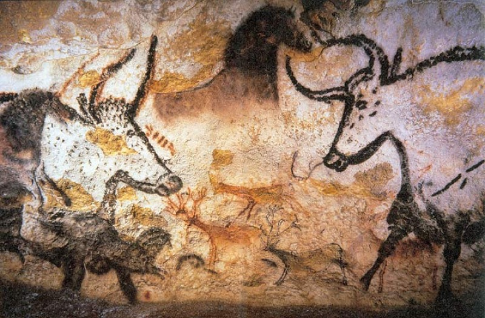
_Cave paintings, Lascaux_
:::

::: {}

- Emergence of symbolic culture
- Emergence of language

:::

::::::

---

## Panini (ca. 7th - 4th century BCE)

:::::: {.two-col}

::: {}
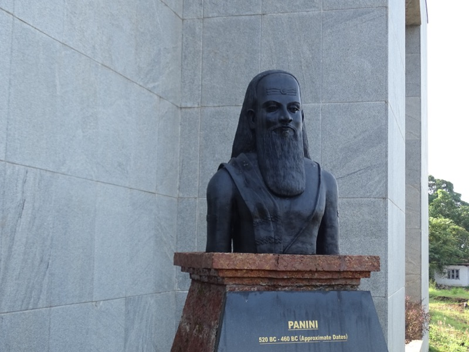
_Modern bust of Panini_
:::

::: {}

- Sanskrit grammarian
- Descriptive linguist
- Developed language about language (syntax, morphology, etc.)

:::

::::::

---

## Ancient Greece
notes from [@altmannHistoryPsycholinguistics2006]

:::::: {.two-col}

::: {}
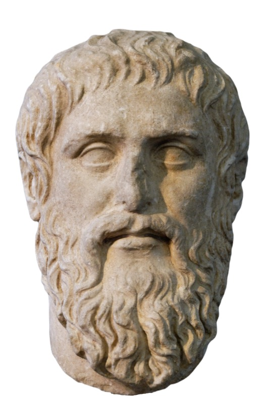
_Plato, Roman copy of a bust by Silanion_
:::

::: {}

- Plato (428–347 BCE)
    - "What does a word mean?"
    - Answer: the referent
    - (See also Wittgenstein: the meaning of a word is knowledge of its use in context)

:::

::::::

---

# 19th Century Europe

Notes from [@leveltHistory]

---

## Wilhelm von Humboldt (1767-1835)

:::::: {.two-col}

::: {}
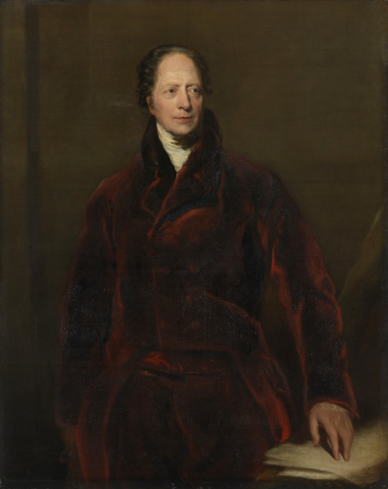
_Wilhelm von Humboldt_
:::

::: {}

- Philosophy of State
- Philosophy of Education
- Diplomat
- Linguist
    - Studied Basque
    - Working on a book about the Kawi language of Java

:::

::::::

---

## Wilhelm von Humboldt

:::::: {.two-col}

::: {}
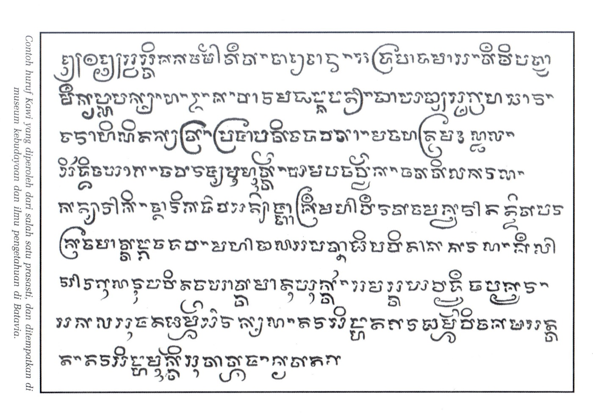
_Kawi script stele_
:::

::: {}

- Language is an activity
- Mentions inner speech (but says little about it)
- Early ideas of linguistic relativity (linguistic affordances)

:::

::::::

---

## Wilhelm von Humboldt

### "_Weltansicht_"

>For Humboldt the world exists for us through language. The diversity of languages is not
>only a diversity of sounds, but a diversity of content as a function of the diversity of
>grammatical forms (Vergleichende Sprachstudium, IV 27, p. 20). In the history of man-
>kind, language and thought are formed simultaneously and reciprocally. [@leveltHistory]

---

## Johann Friedrich Herbart (1776-1841)

:::::: {.two-col}

::: {}

_Johann Friedrich Herbart_
:::

::: {}

- The first psychologist?
- The concept of an "idea"
- "Mental mechanics" concept of psychology

:::

::::::

---

## Johann Friedrich Herbart

:::::: {.two-col}

::: {}

_The Melodrama, Honoré Daumier_
:::

::: {}

- Mental mechanics
    - Conscious and unconscious part
    - Ideas enter our consciousness through senses or memories
    - Consciousness is like a stage
    - "Apperception": when ideas become associated with each other

:::

::::::

---

## Heymann Steinthal (1823-1899)

:::::: {.two-col}

::: {}

_Heymann Steinthal_
:::

::: {}

- Inspired by Herbart
- Only one idea can be "onstage" at a time
    - Through interaction, ideas can gain "energy", and it is this energy that pushes them onto the stage of consciousness

:::

::::::

---

## Heymann Steinthal

:::::: {.two-col}

::: {}
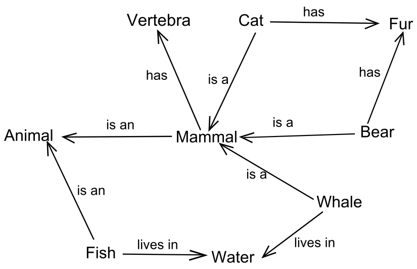
_Semantic network_
:::

::: {}

- Ideas can interact in different ways
    - Fusion
    - Entanglement

:::

::::::

---

## Max Müller (1823-1900)

:::::: {.two-col}

::: {}

_Max Müller_
:::

::: {}

- Studied Sanskrit
- Took Panini's 1100 Sanskrit rootsand reduced them to 121 core concepts

:::

::::::

---

## Max Müller

>"These 121 concepts constitute the stock-in-trade with which I maintain that every thought that has passed through the mind of India, so far as it is known to us in its literature, has been expressed." [@leveltHistory, p. 32]

---

## Max Müller

:::::: {.two-col}

::: {}

_Rigveda manuscript page_
:::

::: {}

- "Language is the true autobiography of mind." [@leveltHistory, p. 32]

:::

::::::

---

## Hermann von Helmholtz (1821-1894)

:::::: {.two-col}

::: {}

_Hermann von Helmholtz_
:::

::: {}

- Lots of contributions to science, mostly in physics
- Measured the speed of neurotranmission by applying electricity to a dissected frog leg

:::

::::::

---

## Diagram Makers

:::::: {.two-col}

::: {}
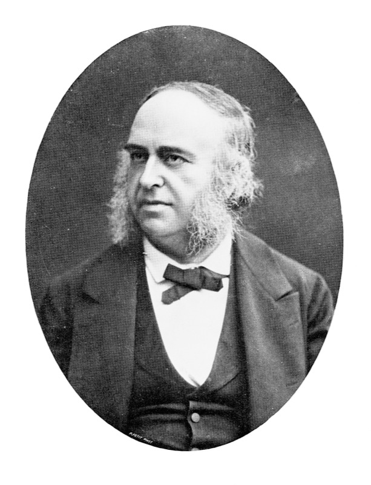
_Paul Broca (1824-1880)_
:::

::: {}
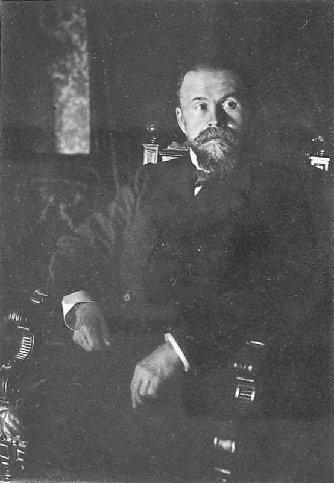
_Carl Wernicke (1848-1905)_
:::

::: {}
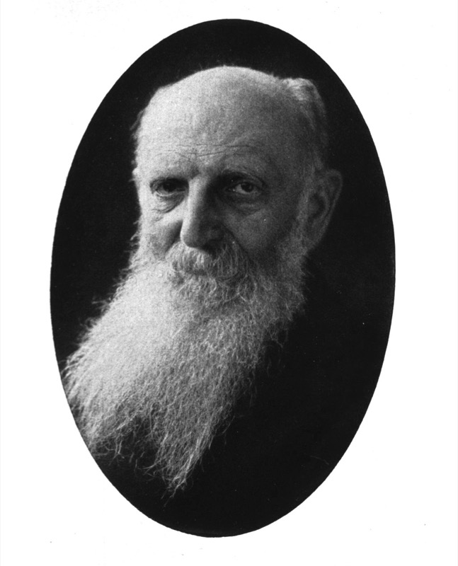
_Ludwig Lichtheim (1845-1928)_
:::

::::::

---

## Wernicke-Lichtheim Model

:::::: {.two-col}

::: {}
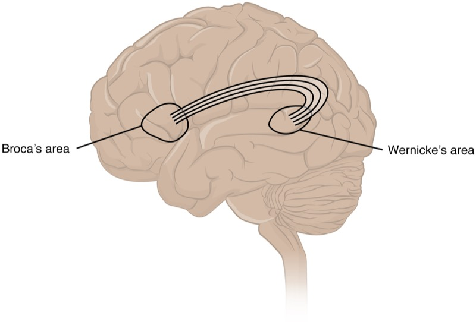
_Broca's and Wernicke's areas_
:::

::: {}
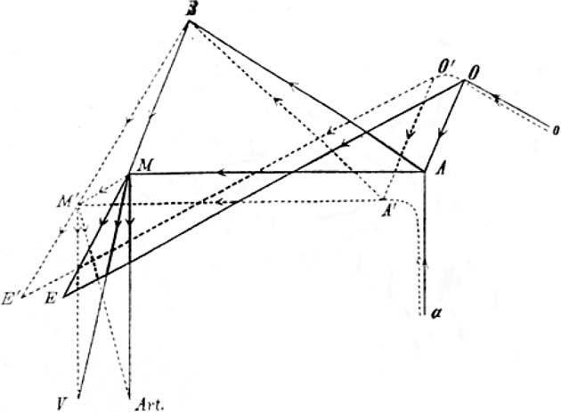
_Lichtheim's model (extended by Knoblauch)_
:::

::::::

---

## Wilhelm Wundt (1832-1920)

:::::: {.two-col}

::: {}

_Wilhelm Wundt_
:::

::: {}

- Medical doctor - physiology
- "Contributions to the Theory of Sense Perception" (1858–1862)
- "Lectures on Human and Animal Psychology" (1863–1864)
- "Principles of Physiological Psychology" (1874)

:::

::::::

---

## Wilhelm Wundt 

:::::: {.two-col}

::: {}
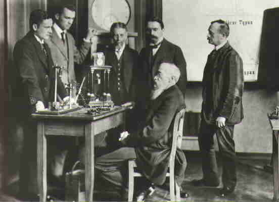
_Wundt's research group, Leipzig_
:::

::: {}

- Laboratory of experimental psychology
- Timing
- Volition
- Visitors to the lab included
    - Edward Sapir
    - Benjamin Lee Whorf
    - Edmund Husserl (phenomenology)
    - Franz Boas (anthropology)

:::

::::::

---

## Wilhelm Wundt 

:::::: {.two-col}

::: {}

_Wilhelm Wundt_

:::

::: {}

>The state, characterised by a specific sensation, which accompanies the clearer focusing of some mental content we call _attention_; the specific process by which some mental content is brought into clear focus [we call] apperception. [@leveltHistory]

:::

::::::

---

## Franciscus Donders (1818-1889)

:::::: {.two-col}

::: {}

_Franciscus Donders_
:::

::: {}

- Helmholtz had shown neural transmission takes time
- Donders showed that cognitive function also takes time
- Simple reaction time is faster than choice reaction time

:::

::::::

---

## Franciscus Donders

:::::: {.two-col}

::: {}
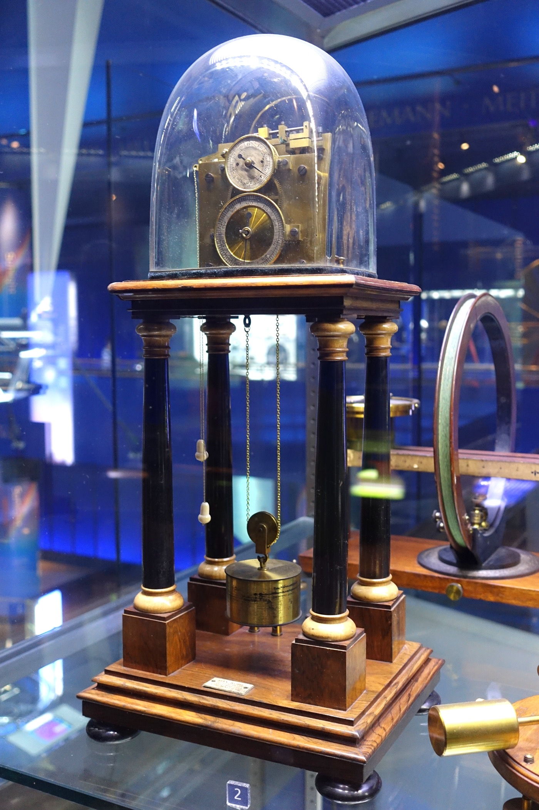
_Hipp Chronoscope_
:::

::: {}

- Friedrich Wilhelm Bessel described "personal equation" in astronomy
- Individual differences
- Donders applied to cognition
- Invented the go/no-go task (with stimulation of feet!)

:::

::::::

---

# Early 20th Century United States

Notes from [@leveltHistory]

---

## James McKeen Cattell (1860-1944)

:::::: {.two-col}

::: {}

_James McKeen Cattell_
:::

::: {}

- Wundt's PhD student
- Time it takes to read letters
- Word superiority effect
    - RED is faster than DER
    - BRANE is faster than BENAR

:::

::::::

---

## B. F. Skinner (1904-1990)

:::::: {.two-col}

::: {}
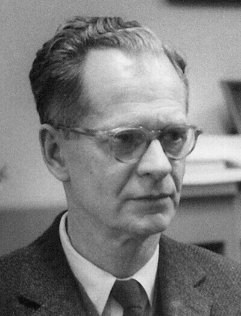
_B. F. Skinner_
:::

::: {}

- Behaviorist psychology
- Verbal behavior
- Language as a response to a stimulus

:::

::::::

---

## Noam Chomsky (b. 1928)

:::::: {.two-col}

::: {}
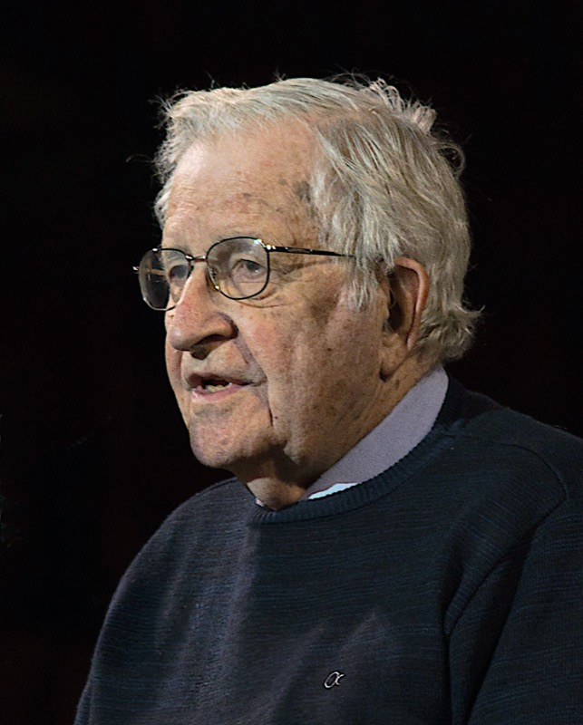
_Noam Chomsky_
:::

::: {}

- "Cognitive" turn in linguistics
- Rejection of behaviorism
- Language as integral part of human biology and psychology

:::

::::::

---

## Shannon and Weaver

:::::: {.two-col}

::: {}
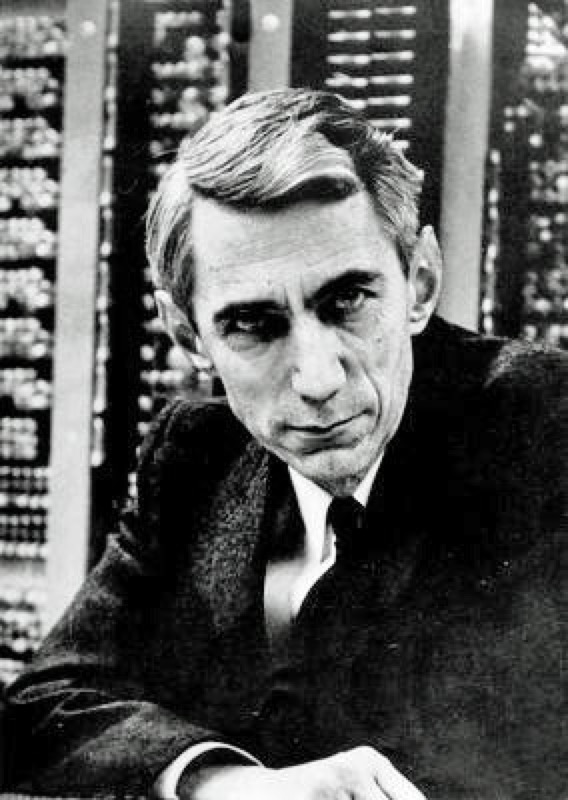
_Claude Shannon (1916-2001)_
:::

::: {}
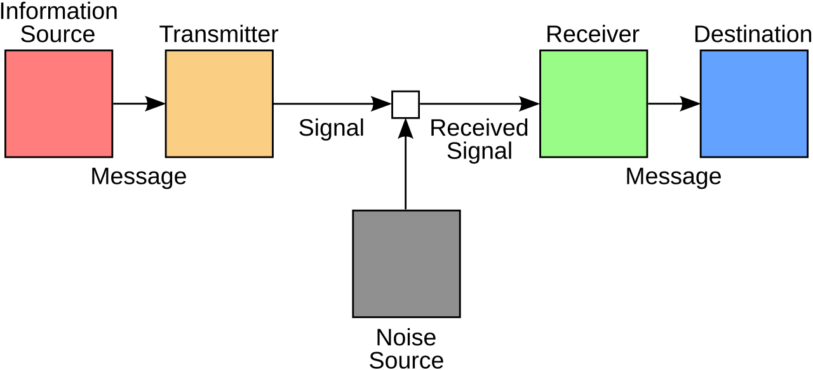
_Shannon-Weaver model of communication_
:::

::: {}
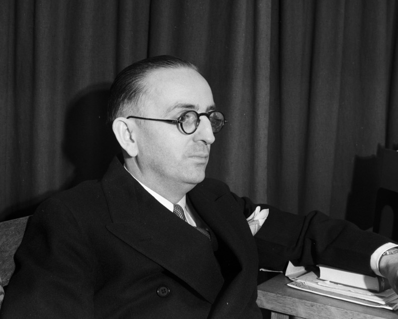
_Warren Weaver (1894-1978)_
:::

::::::

# Slightly more recent 20th century (USA)

---

## Roger Brown (1925-1997)

:::::: {.two-col}

::: {}
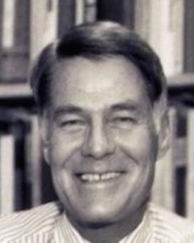
_Roger Brown_
:::

::: {}

- Social psychologist
- [Transcripts](https://talkbank.org/childes/access/Eng-NA/Brown.html) of natural language in three children (Adam, Eve, and Sarah)
- Took child language seriously
- Book: _A First Language: The Early Stages_

:::

::::::

---

## Victoria Fromkin (1923-2000)

:::::: {.two-col}

::: {}
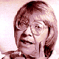
_Victoria Fromkin_
:::

::: {}

- Linguistic production
- Recorded and classified speech errors
- [Fromkin's Speech Error Database](https://www.mpi.nl/dbmpi/sedb/sperco_form4.pl)

:::

::::::

---

## Ursula Bellugi (1931-2022)

:::::: {.two-col}

::: {}
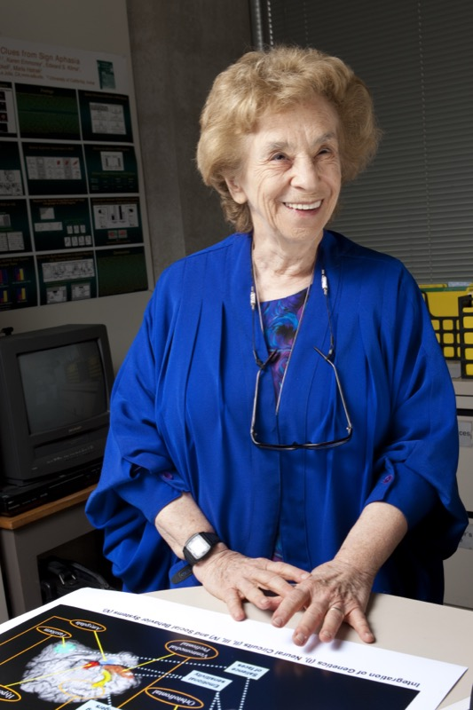
_Ursula Bellugi_
:::

::: {}

- Student of Robert Brown
- Studied neurobiology of sign language (left-lateralized, just like spoken language)
- Neurobiology of Williams Syndrome

:::

::::::

---

## Jean Berko Gleason (b. 1931)

:::::: {.two-col}

::: {}
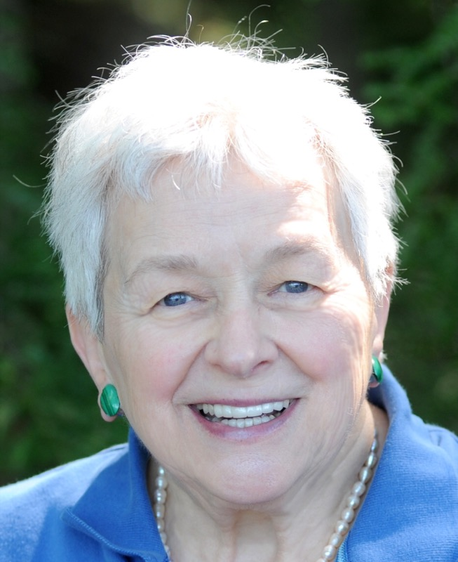
_Jean Berko Gleason_
:::

::: {}

- Also a student of Roger Brown
- Morphosyntactic development in children
- Famous for the "wug test"

:::

::::::

---

## Ellen Bialystok (b. 1946)

:::::: {.two-col}

::: {}
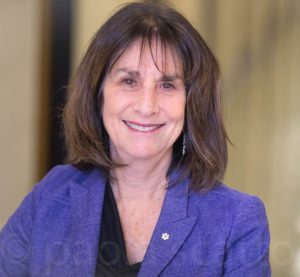
_Ellen Bialystok)_
:::

::: {}

- Bilingualism
- Executive control and the "bilingual advantage"

:::

::::::

---

## Letitia Naigles

:::::: {.two-col}

::: {}
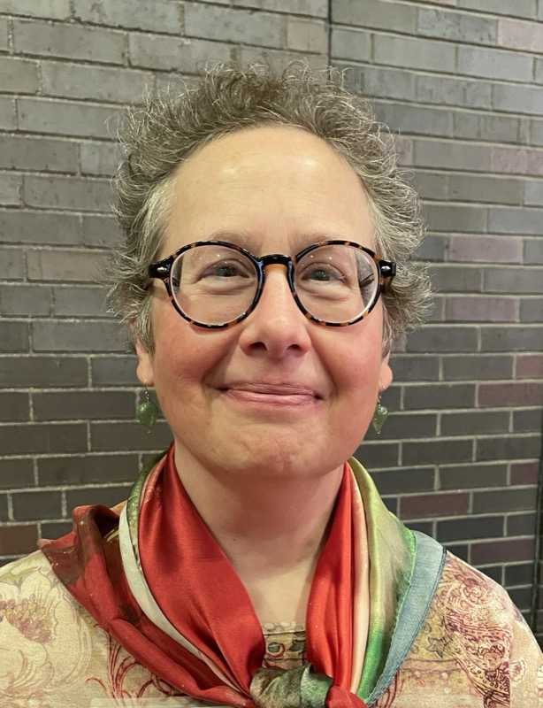
_Letitia Naigles_
:::

::: {}

- "Syntactic bootstrapping" in language development
- Language development in children with autism
- Longitudinal Study of Early Language with Deborah Fein

:::

::::::

---

## Elizabeth Bates (1947-2003)

:::::: {.two-col}

::: {}
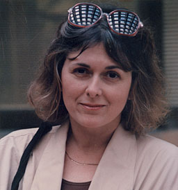
_Elizabeth Bates_
:::

::: {}

- "Emergentist" view of language and language development (with Brian MacWhinney)
- Languages are shaped by evolution-like pressures
- Hearers use linguistic cues to calculate probabilities for likely interpretations

:::

::::::

---

## Elissa Newport (b. 1947)

:::::: {.two-col}

::: {}
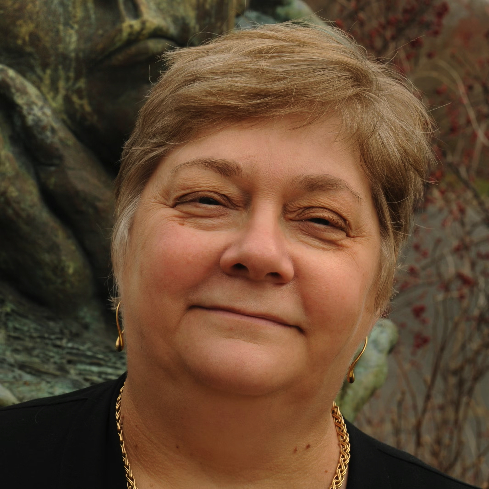
_Elissa Newport_
:::

::: {}

- Learning of artificial languages
- Statistical learning
- "Less is more" hypothesis: because children are less cognitively developed than adults, they concentrate on simpler aspects of the linguistic system, and this is an advantage in language learning

:::

::::::

---

---

# Images

## Images {.scrollable}

- **Cave paintings, Lascaux**: Cave paintings of aurochs, horses, and deer, Lascaux (Montignac, Dordogne, France), Upper Paleolithic, c. 17,300 years old. Photo: Prof saxx, Wikimedia Commons, CC BY-SA 3.0 / GFDL
- **Modern bust of Panini**: Modern bust of Pāṇini. Photo: Jameela P., Wikimedia Commons, CC BY-SA 4.0
- **Plato, Roman copy of a bust by Silanion**: Bust of Plato, Roman copy of a Greek original by Silanion, Musei Capitolini. Photo: Marie-Lan Nguyen, Wikimedia Commons, CC BY 2.5
- **Wilhelm von Humboldt**: Portrait of Wilhelm von Humboldt by Thomas Lawrence
- **Kawi script stele**: Stone stele in Kawi script, copied in Thomas Stamford Raffles' *The History of Java* (1817). Wikimedia Commons, public domain
- **Johann Friedrich Herbart**: Portrait of Johann Friedrich Herbart, engraving by Konrad Geyer (1816–1893), after C. H. Steffens; published in *Pädagogische Schriften in chronologischer Reihenfolge* (Leipzig: Voss, 1880). Wikimedia Commons, public domain
- **The Melodrama, Honoré Daumier**: *The Melodrama*, Honoré Daumier, c. 1856–1860, Neue Pinakothek, Munich. Wikimedia Commons (Yorck Project), public domain
- **Heymann Steinthal**: Portrait of Heymann Steinthal, photogravure by Synnberg Photo-gravure Co., 1898. Wellcome Collection via Wikimedia Commons, CC BY 4.0
- **Semantic network**: "Semantic Net.svg", example diagram of a semantic network, by Konstable, Wikimedia Commons, public domain
- **Max Müller**: Portrait of Max Müller by W. Forshaw, from Cassell's Universal Portrait Gallery (c. 1895). Wikimedia Commons, public domain
- **Rigveda manuscript page**: Rigveda manuscript page, Devanagari script. Wikimedia Commons, CC BY-SA 4.0
- **Paul Broca**: Portrait of Paul Broca, photograph by Pierre Petit. Wellcome Collection via Wikimedia Commons, CC BY 4.0
- **Carl Wernicke**: Portrait of Carl Wernicke, photograph by Max Glauer, c. 1900, published in *Monatsschrift für Psychiatrie und Neurologie* (1906). Wikimedia Commons, public domain
- **Ludwig Lichtheim**: Portrait of Ludwig Lichtheim, c. 1925, photographer unknown. Images from the History of Medicine (NLM), via Wikimedia Commons, public domain
- **Broca's and Wernicke's areas**: Diagram of Broca's area, Wernicke's area, and the arcuate fasciculus connecting them. OpenStax College, *Anatomy & Physiology*, Wikimedia Commons, CC BY 3.0
- **Lichtheim's model (extended by Knoblauch)**: August Knoblauch's diagrammatic model of music processing overlaid on Lichtheim's model of language, from Knoblauch, "On disorders of the musical capacity from cerebral disease," *Brain* 13, pp. 317–340 (1890). Wikimedia Commons, public domain
- **Wilhelm Wundt**: Portrait of Wilhelm Wundt, photogravure by Synnberg Photo-gravure Co., 1898. Wellcome Collection via Wikimedia Commons, CC BY 4.0
- **Wundt's research group, Leipzig**: Wundt's research group, Leipzig, c. 1880. University of Leipzig Institute of Psychology archives, via Wikimedia Commons, public domain
- **Hermann von Helmholtz**: Portrait of Hermann von Helmholtz, photographed by Julius Cornelius Schaarwächter, 1884. Wikimedia Commons, public domain
- **Franciscus Donders**: Portrait of Franciscus Donders by Bramine Hubrecht, 1889. Wikimedia Commons, public domain
- **Hipp Chronoscope**: Hipp Chronoscope, c. 1890, the kind of precision timing instrument used in Donders' Utrecht laboratory. Museum of Science and Industry, Chicago. Photo: Daderot, Wikimedia Commons, CC0
- **James McKeen Cattell**: Portrait of James McKeen Cattell. Bain News Service, Library of Congress, via Wikimedia Commons, public domain
- **Disc tachistoscope**: Disc tachistoscope apparatus, C. H. Stoelting Co., Chicago, illustration from Guy Montrose Whipple, *Manual of Mental and Physical Tests* (Warwick & York, 1921), digitized by Internet Archive Book Images. Wikimedia Commons, public domain (no known copyright restrictions)
- **B. F. Skinner**: B. F. Skinner at Harvard, c. 1950. Wikimedia Commons (uploaded by Silly rabbit, edited by Michaelrayw2), CC BY 3.0 / GFDL
- **Noam Chomsky**: Portrait of Noam Chomsky, International Forum for Emancipation and Equality, Buenos Aires, 2015. Photo: Augusto Starita / Ministerio de Cultura de la Nación Argentina, via Wikimedia Commons, CC BY-SA 2.0
- **Ursula Bellugi**: Portrait of Ursula Bellugi, 2010. Photo: Chris Keeney, Wikimedia Commons, CC BY-SA 4.0
- **Jean Berko Gleason**: Portrait of Jean Berko Gleason, 2011. Photo courtesy of Jean Berko Gleason, via Wikimedia Commons, CC BY-SA 3.0 / GFDL
- **Letitia Naigles**: Portrait of Letitia Naigles at BUCLD, 2024. Photo: Brooks patty, Wikimedia Commons, CC BY-SA 4.0
- **Claude Shannon**: Portrait of Claude Shannon. Photo: Konrad Jacobs, Oberwolfach Photo Collection, via Wikimedia Commons, CC BY-SA 2.0 DE
- **Warren Weaver**: Portrait of Warren Weaver, January 9, 1940. Photo: Donald Cooksey, Lawrence Berkeley National Laboratory / National Archives, via Wikimedia Commons, public domain
- **Shannon-Weaver model of communication**: Diagram of the Shannon-Weaver model of communication. Wikimedia Commons (User:Phlsph7, based on a diagram by Wanderingstan and Stannered), CC0
- **Victoria Fromkin**: Portrait of Victoria Fromkin. UCLS Department of Linguistics [https://linguistics.ucla.edu/person/victoria-fromkin/] (no known copywrite restrictions)
- **Ellen Bialystok**: Portrait of Ellen Bialystok. York University [https://lcad.lab.yorku.ca] (no known copywrite restrictions)
- **Elizabeth Bates**: Portrait of Elizabeth Bates. Center for Research on Language. [https://crl.ucsd.edu/bates/obituary/] (no known copywrite restrictions)
- **Elissa Newport**: Portrait of Elissa Newport. Georgetown Univeristy [https://cbpr.georgetown.edu/elissa-newport/] (no known copywrite restrictions)

---

# References

## References {.scrollable}

::: {#refs}
:::
