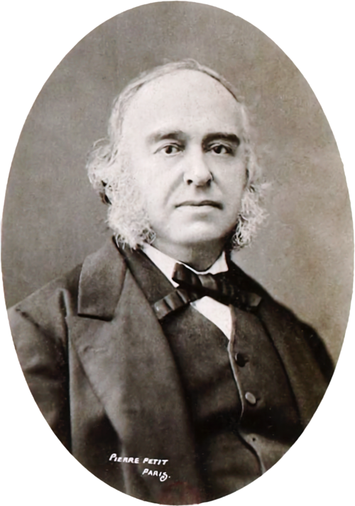
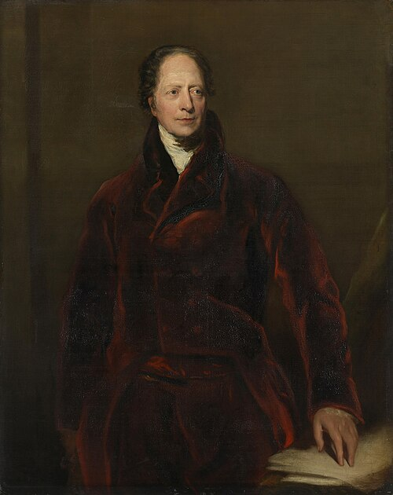
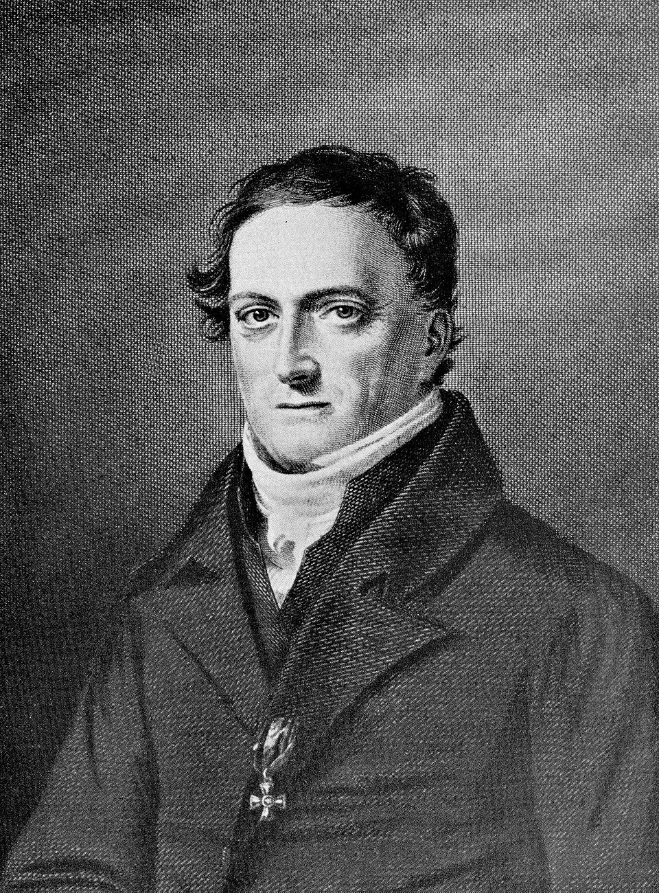
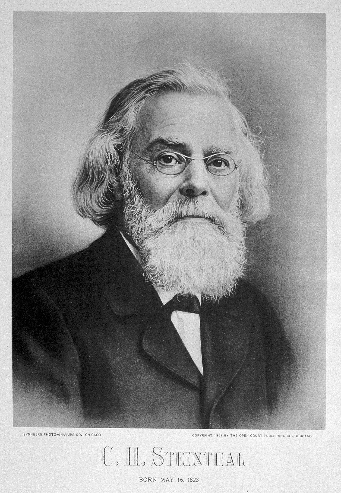
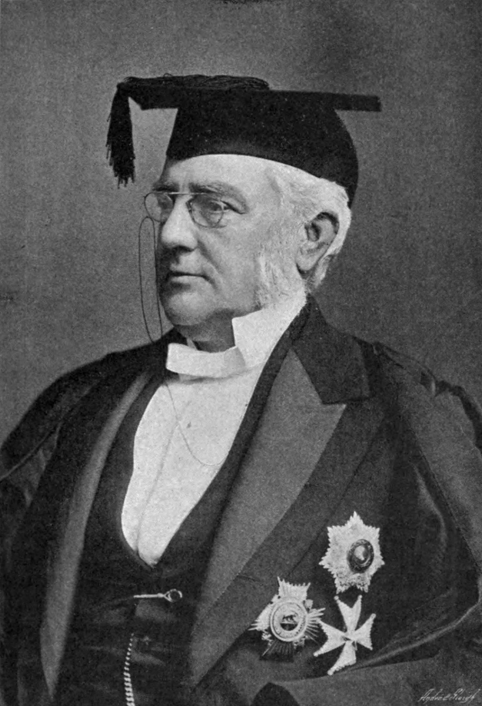
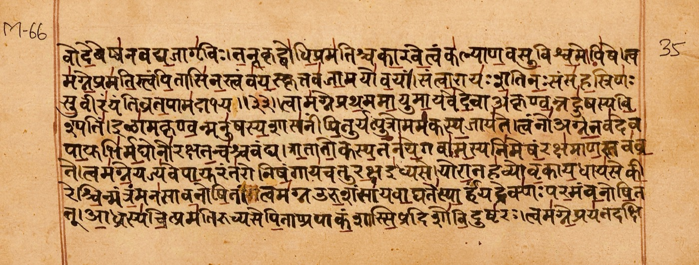
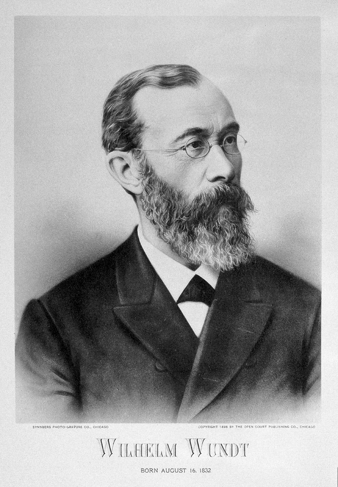
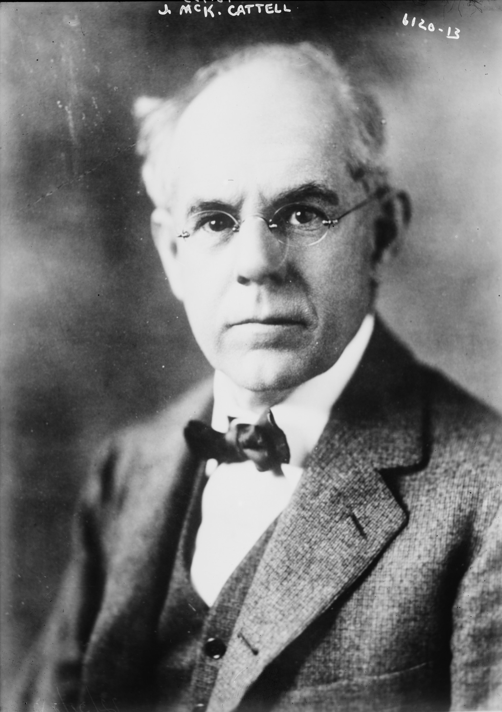

# Ancient history

---

## Prehistoric people

:::::: {.two-col}

::: {}

:::

::: {}
_Caption_ (DATE)

TEXT

:::

::::::

---

## Ancient Sanskrit

:::::: {.two-col}

::: {}

:::

::: {}
_Caption_ (DATE)

TEXT

:::

::::::

---

## Ancient Greece

:::::: {.two-col}

::: {}

:::

::: {}
_Caption_ (DATE)

TEXT

:::

::::::

---

## 18th Century Romanticism

Notes from [@leveltHistory]

:::::: {.two-col}

::: {}

:::

::: {}
_Caption_ (DATE)

TEXT

:::

::::::

---

# 19th Century Europe

Notes from [@leveltHistory]

---

## Wilhelm von Humboldt (1767-1835)

:::::: {.two-col}

::: {}

_Wilhelm von Humboldt_
:::

::: {}

- Philosophy of State
- Philosophy of Education
- Diplomat
- Linguist
    - Studied Basque
    - Working on a book about the Kawi language of Java

:::

::::::

---

:::::: {.two-col}

::: {}

_Kawi script stele_
:::

::: {}

- Language is an activity
- Mentions inner speech (but says little about it)
- Early ideas of linguistic relativity (linguistic affordances)

:::

::::::

---

## Johann Friedrich Herbart (1776-1841)

:::::: {.two-col}

::: {}

_Johann Friedrich Herbart_
:::

::: {}

- The first psychologist?
- The concept of an "idea"
- "Mental mechanics" concept of psychology

:::

::::::

---

:::::: {.two-col}

::: {}

_The Melodrama, Honoré Daumier_
:::

::: {}

- Mental mechanics
    - Our inner life has a conscious and unconscious part
    - Ideas enter our consciousness through senses or memories
    - Consciousness is like a stage where ideas appear, interact, and then disappear offstage
    - When ideas become associated with each other, Herbart called this "apperception" (we will return to this with Wundt)

:::

::::::

---

## Heymann Steinthal (1823-1899)

:::::: {.two-col}

::: {}

_Heymann Steinthal_
:::

::: {}

- Inspired by Herbart
- Only one idea can be "onstage" at a time
    - Through interaction, ideas can gain "energy", and it is this energy that pushes them onto the stage of consciousness

:::

::::::

---

:::::: {.two-col}

::: {}

_Humboldt-Universität zu Berlin_
:::

::: {}

- Ideas can interact in different ways
    - Fusion: I see my cat, then later I see him again. The first image I have fuses with the later images I have, and they become one: my abstract idea of my cat
    - Entanglement: Ideas can become connected to each other, but still separate. My idea of "my cat" can become entangled with my idea of "animal", and also "pet"

:::

::::::

---

## Max Müller (1823-1900)

:::::: {.two-col}

::: {}

_Max Müller_
:::

::: {}

- Studied Sanskrit
- Took the 1100 Sanskrit roots that Panini had written down two thousand years earlier and reduced them to 121 core concepts
    - "These 121 concepts constitute the stock-in-trade with which I maintain that every thought that has passed through the mind of India, so far as it is known to us in its literature, has been expressed." [@leveltHistory, p. 32]

:::

::::::

---

:::::: {.two-col}

::: {}

_Rigveda manuscript page_
:::

::: {}

- "Language is the true autobiography of mind." [@leveltHistory, p. 32]

:::

::::::

---

## Wilhelm Wundt (1832-1920)

:::::: {.two-col}

::: {}

_Wilhelm Wundt_
:::

::: {}

- Medical doctor - physiology
- "Contributions to the Theory of Sense Perception" (1858–1862)
- "Lectures on Human and Animal Psychology" (1863–1864)
- "Principles of Physiological Psychology" (1874)

:::

::::::

---

:::::: {.two-col}

::: {}

_Wundt's research group, Leipzig_
:::

::: {}

- Laboratory of experimental psychology
- Timing - clocks, electronic
- Visitors to the lab included
    - Edward Sapir
    - Benjamin Lee Whorf
    - Edmund Husserl (phenomenology)
    - Franz Boas (anthropology)

:::

::::::

---

:::::: {.two-col}

::: {}

_Wilhelm Wundt_
:::

::: {}

- Wundt's "apperception"
    - Redefinition of Herbart's word
    - "The state, characterised by a specific sensation, which accompanies the clearer focusing of some mental content we call _attention_; the specific process by which some mental content is brought into clear focus [we call] apperception."
    - Levelt: Wundt's "apperception" is very similar to the modern idea of "executive control"
- Volition

:::

::::::

---

## Franciscus Donders (1818-1889)

:::::: {.two-col}

::: {}

_Franciscus Donders_
:::

::: {}

- Hermann von Helmholtz had shown neural transmission takes time
- Donders showed that cognitive function also takes time
    - Simple reaction time is faster than choice reaction time

:::

::::::

---

:::::: {.two-col}

::: {}

_Hipp Chronoscope_
:::

::: {}

- Invented the go/no-go task (with stimulation of feet!)

:::

::::::

---

## James McKeen Cattell (1860-1944)

:::::: {.two-col}

::: {}

_James McKeen Cattell_
:::

::: {}

- Wundt's PhD student
- Time it takes to read letters

:::

::::::

---

:::::: {.two-col}

::: {}
_(no suitable public-domain image found for this slide yet — TBD)_
:::

::: {}

- Word superiority effect
    - RED is faster than DER
    - BRANE is faster than BENAR

:::

::::::

---

# Early 20th Century Europe and United States

Notes from [@leveltHistory]

---

## 1951

TEXT

---

# Late 20th Century

Notes from [@leveltHistory]

---

# Images

## Images {.scrollable}

- **humboldt.jpg** — Portrait of Wilhelm von Humboldt by Thomas Lawrence
- **humboldt_related.jpg** — Stone stele in Kawi script, copied in Thomas Stamford Raffles' *The History of Java* (1817). Wikimedia Commons, public domain
- **herbart.jpg** — Portrait of Johann Friedrich Herbart, engraving by Konrad Geyer (1816–1893), after C. H. Steffens; published in *Pädagogische Schriften in chronologischer Reihenfolge* (Leipzig: Voss, 1880). Wikimedia Commons, public domain
- **theater_Honoré_Daumier.jpg** — *The Melodrama*, Honoré Daumier, c. 1856–1860, Neue Pinakothek, Munich. Wikimedia Commons (Yorck Project), public domain
- **steinthal.jpg** — Portrait of Heymann Steinthal, photogravure by Synnberg Photo-gravure Co., 1898. Wellcome Collection via Wikimedia Commons, CC BY 4.0
- **steinthal_related.jpg** — Main building of Humboldt-Universität zu Berlin, where Steinthal taught. Photo: Christian Wolf, Wikimedia Commons, CC BY-SA 3.0 DE
- **muller.jpg** — Portrait of Max Müller by W. Forshaw, from Cassell's Universal Portrait Gallery (c. 1895). Wikimedia Commons, public domain
- **muller_related.jpg** — Rigveda manuscript page, Devanagari script. Wikimedia Commons, CC BY-SA 4.0
- **wundt.jpg** — Portrait of Wilhelm Wundt, photogravure by Synnberg Photo-gravure Co., 1898. Wellcome Collection via Wikimedia Commons, CC BY 4.0
- **wundt_lab.jpg** — Wundt's research group, Leipzig, c. 1880. University of Leipzig Institute of Psychology archives, via Wikimedia Commons, public domain
- **donders.jpg** — Portrait of Franciscus Donders by Bramine Hubrecht, 1889. Wikimedia Commons, public domain
- **donders_apparatus.jpg** — Hipp Chronoscope, c. 1890, the kind of precision timing instrument used in Donders' Utrecht laboratory. Museum of Science and Industry, Chicago. Photo: Daderot, Wikimedia Commons, CC0
- **cattell.jpg** — Portrait of James McKeen Cattell. Bain News Service, Library of Congress, via Wikimedia Commons, public domain
- **broca.png** — attribution not yet confirmed (placeholder image, reused across early stub slides)

---

# References

## References {.scrollable}

::: {#refs}
:::
