# RTs and the mean

---

## Mental chronometry

:::::: {.two-col}

::: {}
{width=70%}
_Hermann von Helmholtz_
:::

::: {}

_Franciscus Donders_
:::

::::::

---

## We love RTs and we love the mean!

notes from [@balotaYapMovingBeyond2011]

- 2010 survey of 285 articles in three leading journals
- 49% of studies used RT as a dependent measure
- Of those, 95% relied primarily on mean RT

---

## The normal distribution

:::::: {.two-col}

::: {}
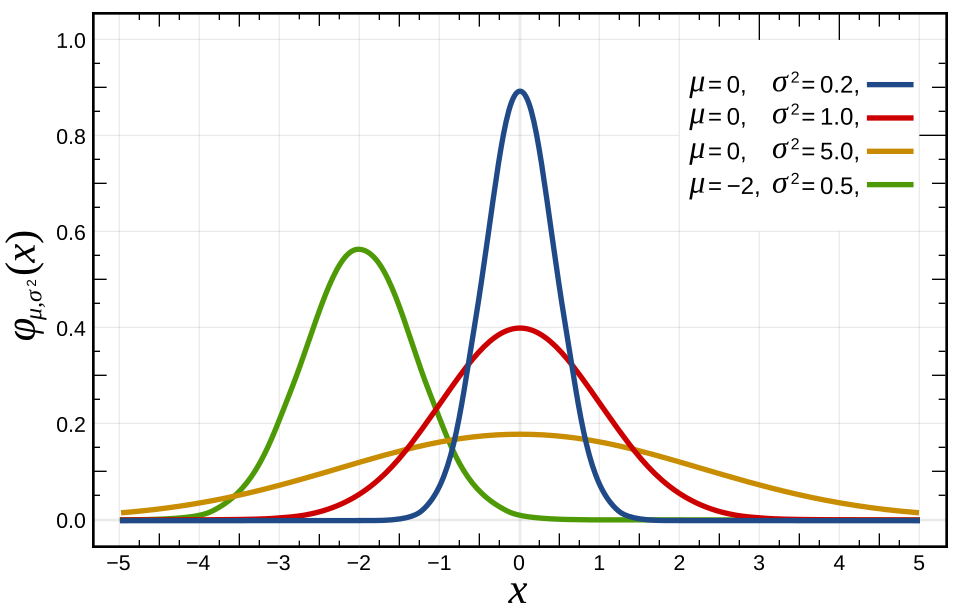
_Normal distribution_
:::

::: {}

- Parameters: mean and standard deviation (mu and sigma)
- Summary statistics: mean and standard deviation
- Implicit model behind most reported statistics

:::

::::::

---

## RT distributions are positive (right) skewed

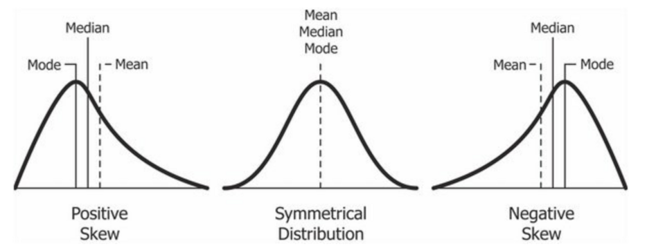
_Skewed distributions_

# Beyond the mean

notes from [@balotaYapMovingBeyond2011]

---

## The ex-Gaussian function

:::::: {.two-col}

::: {}
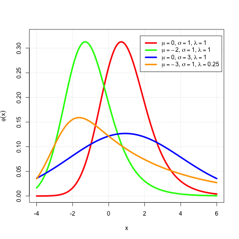
_Wikimedia Commons_
:::

::: {}

- Convolution of a Gaussian and an exponential distribution
- **mu, sigma** — mode and spread of the Gaussian component
- **tau** — mean (and spread) of the exponential component
- Fits empirical RT distributions well

:::

::::::

---

## Fig. 1 — patterns of change

:::::: {.two-col}

::: {}
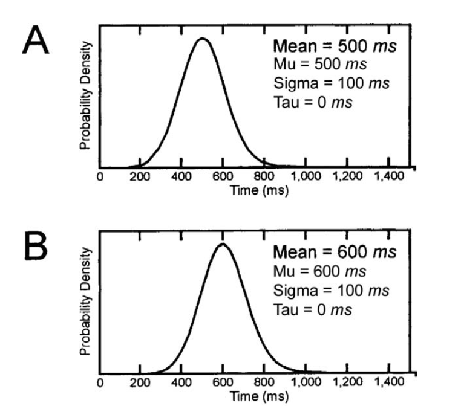
:::

::: {}
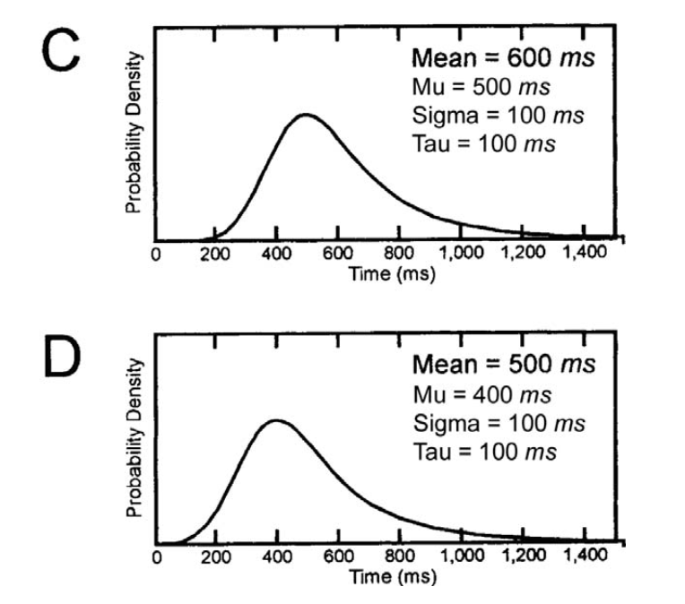
:::

::::::

_Balota & Yap (2011) [@balotaYapMovingBeyond2011]_

- Shift: change in mu only
- Tail stretch: change in tau only
- Trade-off: mu and tau move in opposite directions — mean unchanged

---

## Examples

:::::: {.two-col}

::: {}
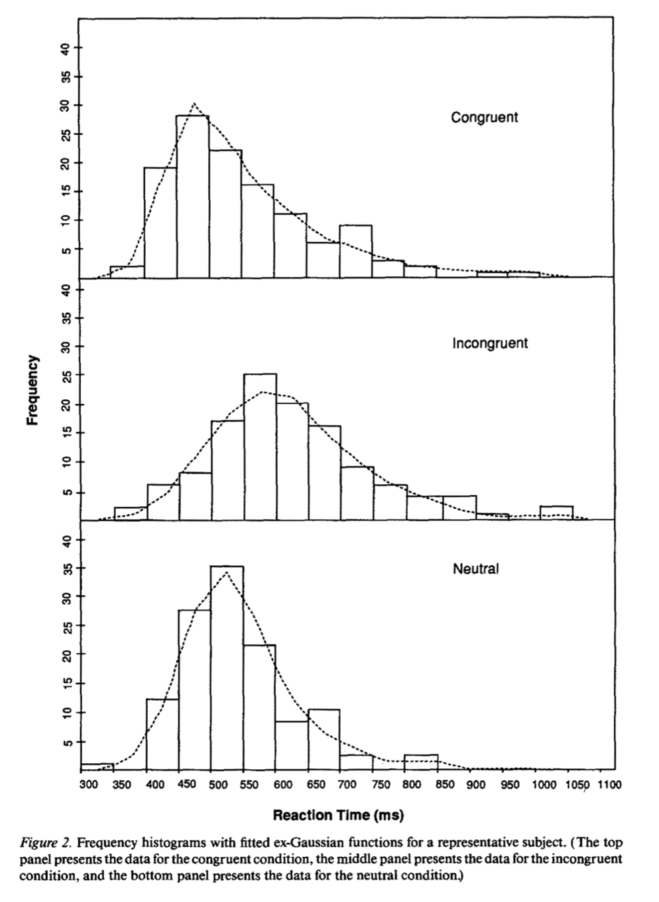
_Stroop RT data [@heathcotePopielMewhort1991]_
:::

::: {}

- Semantic priming → pure shift
- Word frequency → shift + tail stretch
- Stroop-style effects → trade-offs that cancel in the mean

:::

::::::

---

# Our data: masked priming replication

notes from [@peelEffectsWordIdentity2022]

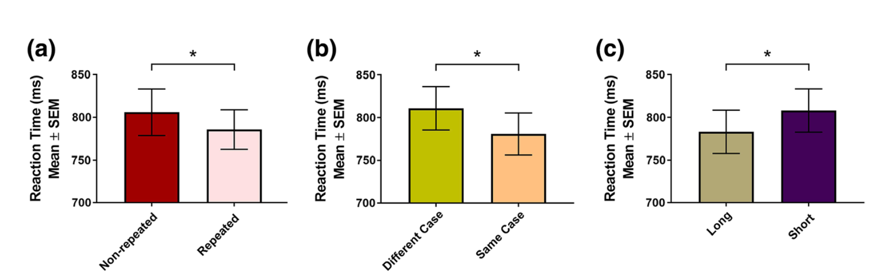
_Subliminal priming [@peelEffectsWordIdentity2022]_

---

## Raw RT distribution

:::::: {.two-col}

::: {}
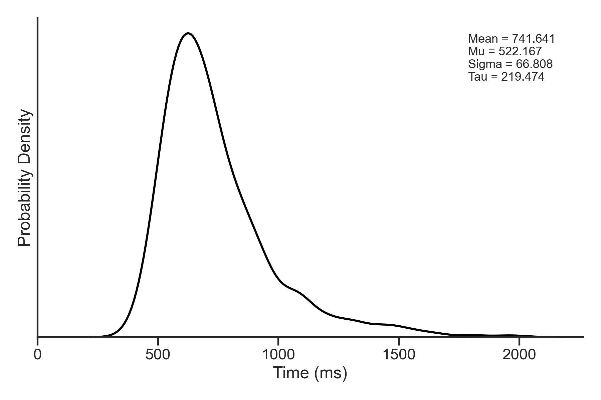
_Empirical KDE_
:::

::: {}
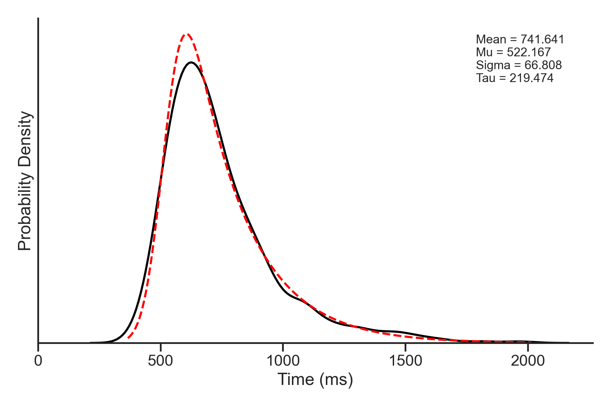
_With theoretical ex-Gaussian fit (red)_
:::

::::::

---

## Quantile analysis

:::::: {.two-col}

::: {}

- Rank-order RTs per participant per condition
- Plot the deciles (.1, .2, … .9)
- Vincentile: compute quantiles per subject, then average across subjects

:::

::: {}
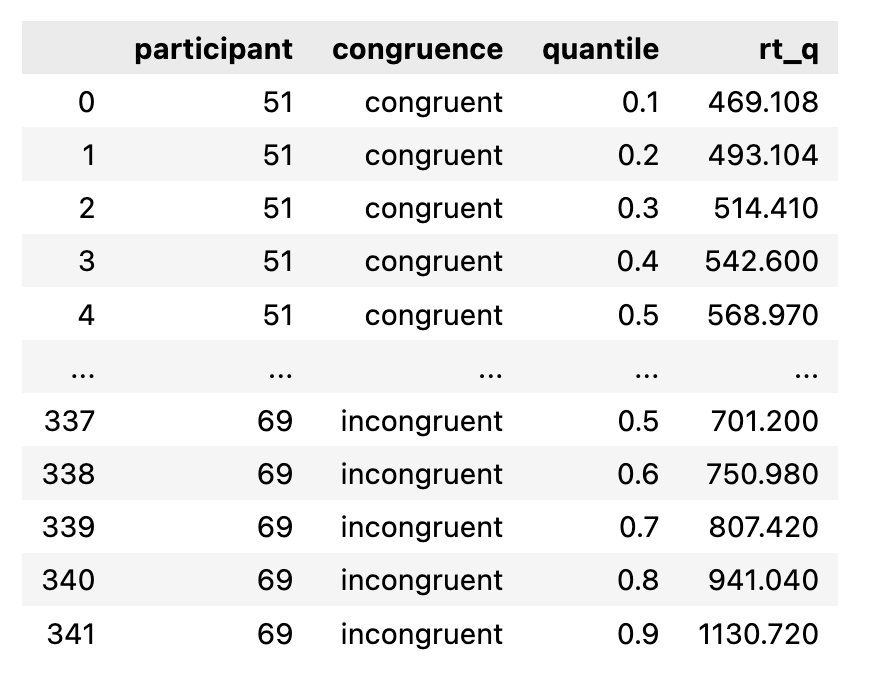
:::

::::::

---

## Quantile plot — congruence

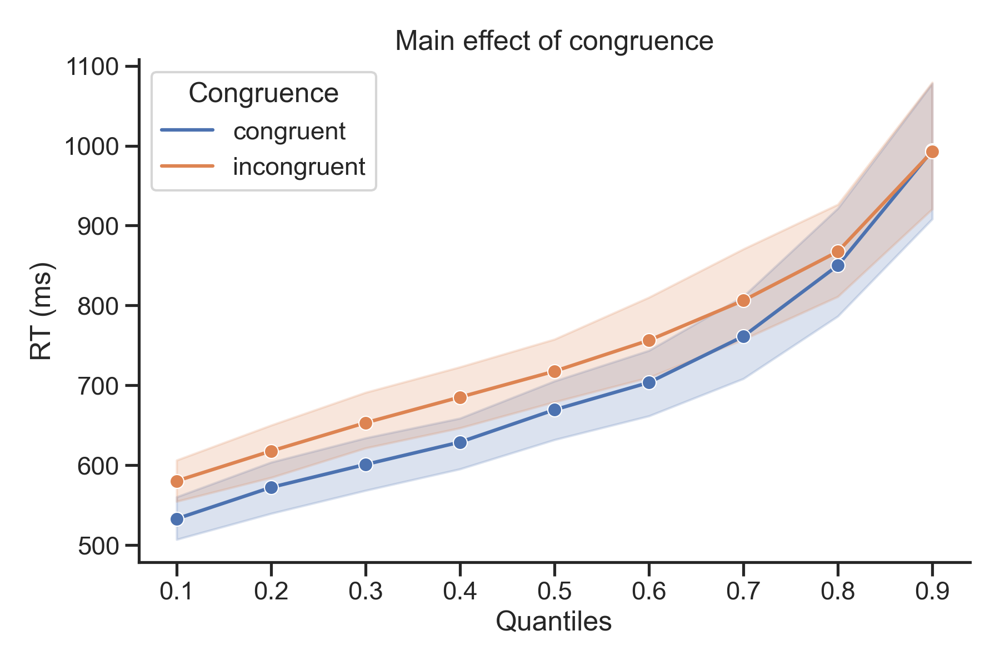

---

## Raw group means

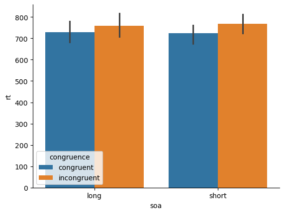

---

## Effects of each parameter

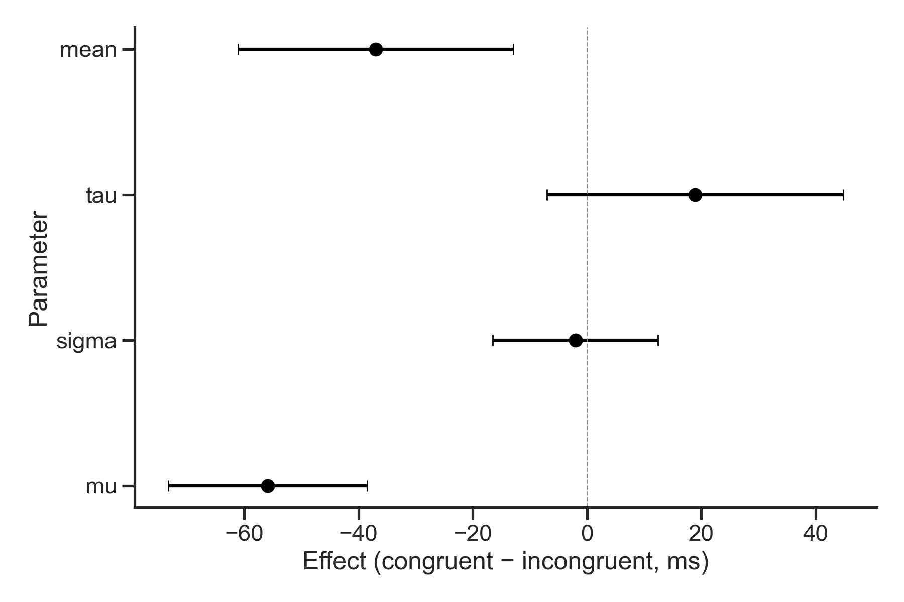

---

## Raw mean vs mu

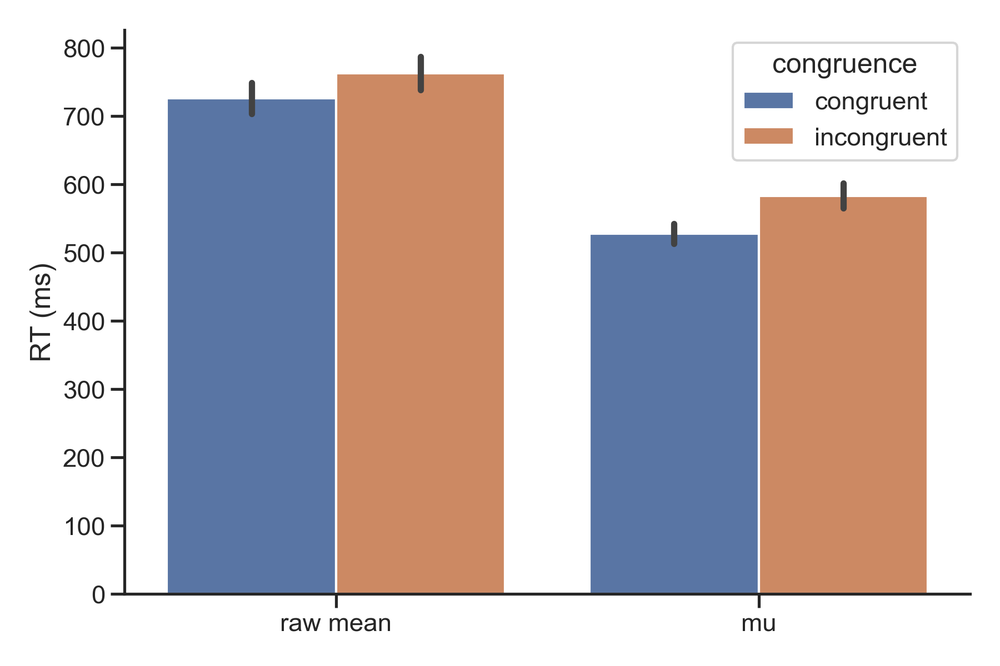

---

## A hidden effect

:::::: {.two-col}

::: {}

:::

::: {}

:::

::: {}

:::

::::::

- theoretical mean = mu + tau
- Our numbers: mu ≈ −56 ms, tau ≈ +19 ms → mean ≈ −37 ms
- The raw mean understates the true modal-RT benefit of congruence
- Same pattern as Fig. 1 panel D (and Heathcote's stroop data)

---

# Beyond Balota & Yap: Testing the parameters

---

## Hypothesis tests

**raw mean**

| T | dof | p-val | CI95% | cohen-d | BF10 | power |
|---|---|---|---|---|---|---|
| -3.004 | 18 | 0.008 | [-62.59, -11.07] | 0.362 | 6.526 | 0.321 |

**mu**

| T | dof | p-val | CI95% | cohen-d | BF10 | power |
|---|---|---|---|---|---|---|
| -6.305 | 18 | <0.001 | [-74.52, -37.27] | 0.782 | 3466.506 | 0.897 |

---

## Takeaways

1. Skew is real and informative
2. Non-normal is not uninteresting
3. Effects on the mean can be a trade-off in disguise
4. Hidden effect in our data!

---

# References

::: {#refs}
:::
