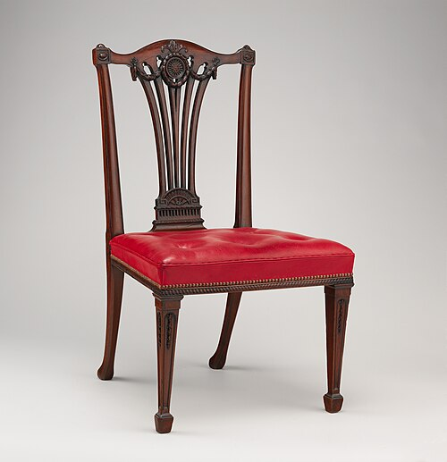
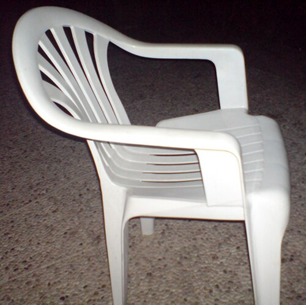
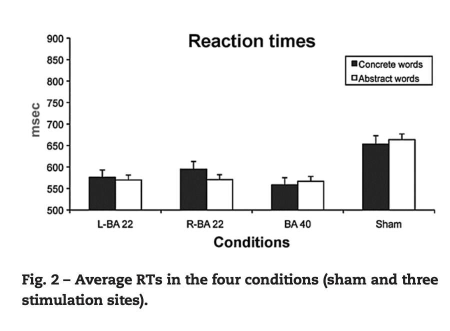
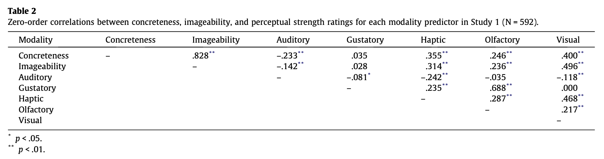
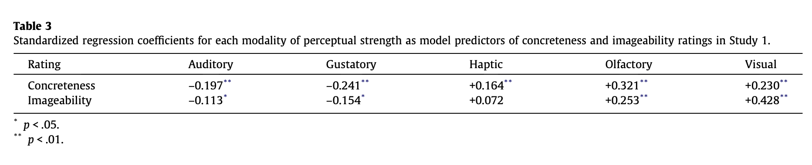
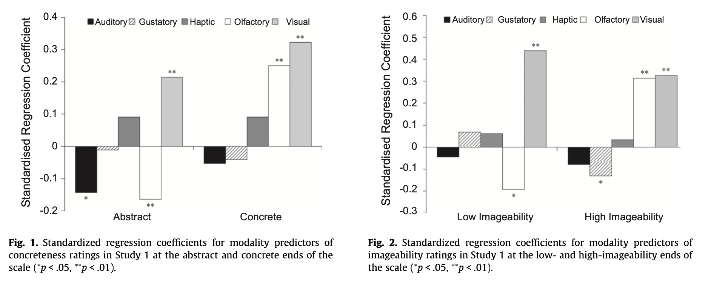
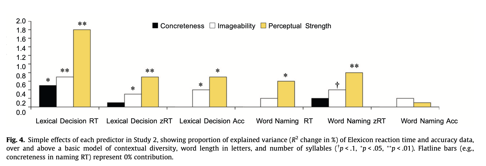

# What is a concreteness effect?

:::::: {.two-col}

::: {}

{width=45%}
{width=45%}

_Chairs_
:::

::: {}

::: {.fragment}
- Concrete words processed faster, more accurately than abstract words
:::
::: {.fragment}
- Shows up in lexical decision, naming, recall
:::
::: {.fragment}
- Treated as a "textbook" finding for decades
:::

:::

::::::

---

## Bock (1982)

[@bockCognitivePsychologySyntax]

- Cites James et al. (1973): more imageable nouns placed earlier / as subject in recall
- Attributed directly to "difficulty retrieving a lexical-semantic code" for abstract concepts
- Groups concreteness with animacy, positive evaluation as established "coding factors"

---

## Bock (1982)

> "One variable with a strong claim to a relationship to ease of lexicalization is concreteness. Concrete objects and events are certainly better coded (in the sense of Rosch et al., 1976) in the standard lexicons of the languages of the world than the apparently more open set of possible abstractions, perhaps because the domains of abstract categories lack the correlational structure that underlies the formation of basic-level concepts (Hampton, 1981)."
>
> — [@bockCognitivePsychologySyntax]

---

## Theoretical explanations

- **Dual coding** (Paivio) — concrete words get a verbal *and* an imagistic code; abstract words only verbal
- **Context availability** (Schwanenflugel & Shoben) — concrete words linked to narrow, easy-to-retrieve contexts
- **Situated simulation** (Barsalou) — concrete words simulate perceptual/motor info; abstract words simulate social/affective/introspective info

---

## But... concreteness effects don't always replicate

:::::: {.two-col}

::: {}

_[@papagnoLexicalProcessingAbstract2009]_
:::

::: {}

- Null effects in some lexical decision studies (e.g., Barca, Burani, & Arduino, 2002)
- Reverse effects: abstract words processed *faster* once other variables controlled (Kousta et al., 2011)
- Neuroimaging findings inconsistent across studies

:::

::::::

---

# Connell & Lynott (2012)

Do concreteness/imageability ratings actually reflect perceptual experience?

---

## Study 1: concreteness ratings

:::::: {.two-col}

::: {}

_[@connellStrengthPerceptualExperience2012]_
:::

::: {}

- Regress concreteness onto 5 perceptual-strength modalities (sound, taste, touch, smell, vision)
- All 5 modalities matter, but not consistently
- Smell even flips sign at abstract vs. concrete ends of the scale

:::

::::::

---

## Study 1: imageability ratings

:::::: {.two-col}

::: {}

_[@connellStrengthPerceptualExperience2012]_
:::

::: {}

- Imageability ratings are visually biased
- Vision is by far the strongest predictor at both ends of the scale
- Other senses inconsistently represented

:::

::::::

---

## Study 2: perceptual strength vs. the ratings

:::::: {.two-col}

::: {}

_[@connellStrengthPerceptualExperience2012]_
:::

::: {}

- Does perceptual strength predict lexical decision / naming better than concreteness or imageability?
- Perceptual strength wins on almost every measure
- Keeps adding predictive power even after concreteness/imageability are controlled for — never the reverse

:::

::::::

---

## Conclusion

Maybe "concreteness effects" are actually **perceptibility effects**

---

## Implications

- Many studies use stimuli chosen based on concreteness or imageability norms
- But maybe concreteness or imageability ratings are not valid?
- Maybe this is why some studies find effects and others don't
- A variable can be treated as settled for 30+ years and still turn out to be poorly operationalized

---

## Discussion

:::::: {.two-col}

::: {}

:::

::: {}

- What would it take to "fix" a classic effect like this — new norms, new theory, or both?
- How should researchers today choose concrete/abstract materials for new experiments?

:::

::::::

---

## New times, new measures

- **Lancaster Sensorimotor Norms** [@lynottLancasterSensorimotorNorms2020] — 40,000 words rated on 6 perceptual modalities + 5 action effectors
- Megastudy data: **English Lexicon Project** [@balotaEnglishLexiconProject2007a]

---

## References {.scrollable}

::: {#refs}
:::
